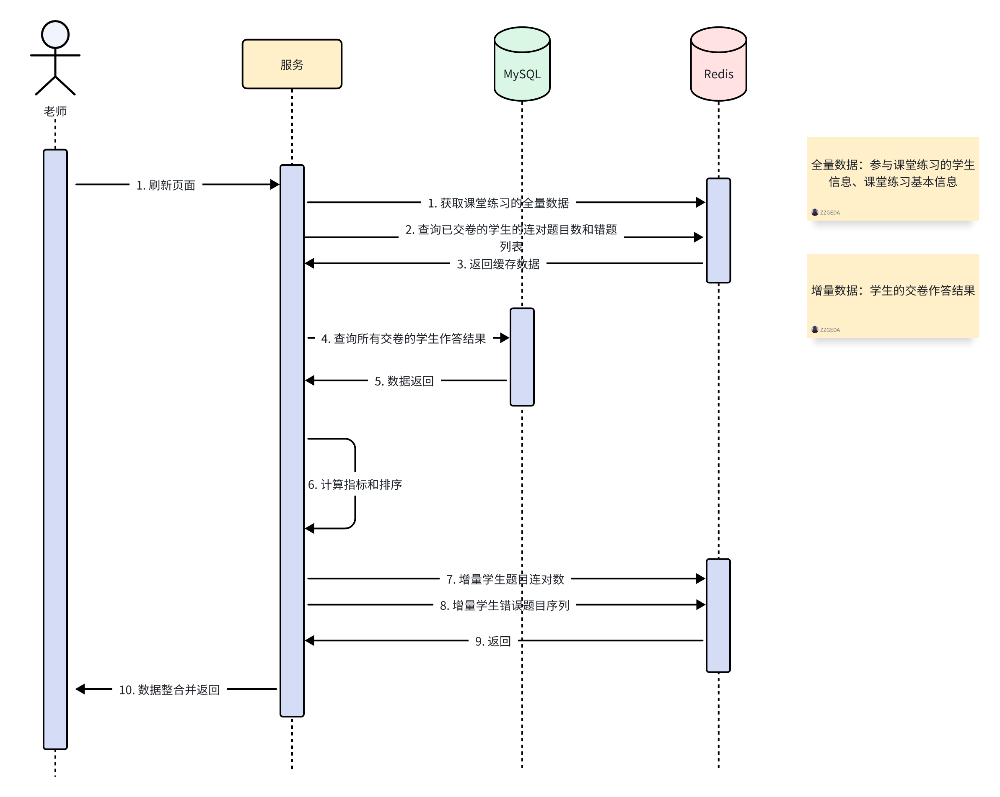

# 2024.12.23  好未来「大小屏」项目提测顺利

&nbsp;&nbsp; Hello，guys~ 好久不见。时过一个月我又来了。让我模仿一下灰太狼“我一定会回来了的”，哈哈哈哈哈。  
&nbsp;&nbsp; 正如大家所看到的，过去的一个月时间内，我的commit记录为0，呜呜呜呜🥹🥹🥹🥹，不是我懒啊，是项目强度太大了，实在是抽不出时间来记录和更新WebRTC这个项目了。
每天回到家中，都是10:00之后的事情了。一个月前的话，我会在公司待到晚上9:00点，然后去健身房锻炼1个小时，但是这个月我光干活就干到了晚上10:00，所以真的没有时间好好记录我的生活和更新我的项目。
所以在这里跟大家说一声抱歉，晚上回家就偷懒了，只会玩手机然后到点睡觉。看来我的意志力还不够强大啊💪，后面我满满将拉下的东西补齐。   
&nbsp;&nbsp; 好的，聊完这些碎碎念，接下来我想来和你聊聊我的收获和感悟，以及我可能今天下午开始的下一个目标🎯。   
&nbsp;&nbsp; 在过去的一个月时间内，我完整的走完了这个项目（还差最后的测试和上线）。从项目前期的需求评审，到前中期的需求拆解和工期评估，到中期的满血开发，一直到后期的提测和测试，以及最终上线。
通过这完整的一个项目，我真切实地地感受到一个项目从**天马行空的想象**到**落地**所要付出的真实代价，和产研团队、UI团队的努力。
* 对于产品侧，他/她们清晰地交付项目需求，落实产品的呈现逻辑和产品与产品之间的关联关系。
* 对于研发侧，我们准确地将产品的需求文字翻译成代码语言，实现产品要求的功能。
* 对于测试侧，他/她们准确的落实产品需求，是项目交付前的保障，保证用户体验的功能是完整和健康的。
* 对于UI侧，他/她们美化产品的设计需求，为用户提供更好的产品体验。  
&nbsp;&nbsp;  一个产品的顺利落地，离不开团队中每一个人的辛勤努力，在本职工作上出色的完成自己份内的任务。而且其实更让我感到惊叹的是，一个40多人的团队竟然就可以为数十万的用户提供完整的线上线下服务。
「咱们的产品的使用场景是在线下教学，为孩子和老师提供新一代互动教学解决方案。所以用户量肯定赶不上其他互联网大厂面向数亿大众的互联网线上产品。**但我依然我们团队做的事情感到骄傲🥰🥰😝**」    
&nbsp;&nbsp; 聊完宏观概念上我感受到团队的付出，接下来聊聊我个人在这其中做的事情和我的提升。    
&nbsp;&nbsp; 这次我负责三个板块的开发任务（三个板块，三周时间开发，一周一个😭😭😭，还好顶住全部搞定了，嘿嘿😁）。
1. 第一个板块是“设备绑定”。这个为用户提供一个设备绑定教室的入口，并针对这个场景设计一系列用户操作页面完成设备增删改查使用的接口。
  这个板块写的接口很多，但是逻辑并不复杂。同时由于设备的绑定和解绑操作只能个人，单次操作，所以并不涉及事务和高并发。都是对单行数据涉及**INSERT**和**UPDATE**操作，所以无需事务。
  设备id和操作者id是1对N的关系，存在小并发情况。即一个设备同时被两个操作者绑定，此时做一个乐观锁即可，只要绑定时的场景符合在边界情况内就允许插入，谁先插入无需关心。
  如果并发操作真的导致同一个设备同时插入的话，数据库层我设置了唯一键，通过接收unique index的报错提示用户更改绑定信息即可。
  在这一个板块中开发难度不大，但是边界情况需要划分清楚，接口写了很多。同时由于是微服务调用，每次写接口都要在两个项目里面写，突然不喜欢微服务了🥹🥹。  
2. 第二个板块是“学习报告展示”。这是个为C端学生提供的新服务。负责向C端学生展示学生的课堂数据，包括互动、答题、错题等数值、指标、详情数据。这个板块是我此次项目开发的大头。
   说这个板块是我此次开发的大头并不是因为这个板块有多难，而是涉及的数据多，需要兼容老逻辑和老数据，展示的内容多。其中一个接口为了展示数据，一个方法就写了400多行代码（当然做了封装和优化，但是部分代码有且只有这个接口会用，就没有做过多的封装了）。
   在这个板块中，用的是go的gin框架，不得不说go是个相当简洁的语言，go func的使用真的相当舒服了。当然整个实习期间，到现在已经4个月了，go已经用的相当顺手了。   
   回到开发模块中，由于是面向C端服务，为了加速页面响应速度，对于部分全量数据，我上了redis缓存。在我的这个业务场景中，不存在Mysql底表数据更新的情况，所以不需要考虑增量数据的缓存一致性问题，
   直接将数据库联表查询的结果处理成最后返回页面的json数据，然后上到redis中就好了。缓存数据根据用户id、讲次id进行绑定，是1对1的使用情况，所以也不存在多线程同时更新数据，所以直接上redis非常安全且提高接口响应速度。
   再来说说，兼容老数据和老逻辑。不得不说，兼容这个事情，在代码层面就是几个if-else，但是对于用户体验上面来说，这几个if-else展示的数据能否满足用户，需要产品决定。最喜欢产品说直接一刀切，嘿嘿😁。
   1. 展示不展示推送逻辑
      
   2. 学习报告大json展示
      
   3. 其他一些时序图我就不传了，嘿嘿
3. 第三个板块是“实时计算展示”。这个接口每5s就会刷新一次，这个qps还是有一定量的。接口返回的数据包括用户排行榜，和两个计算指标，和一个动态变化的“提示信息”。当指标落在区间的不同位置的时候，要展示不同的信息（可不是单一文案这么简单哦，为了展示这个数据，费了我老大劲了）。
   虽然返回的东西不多，但是代码逻辑有点复杂。为了回显这些数据，我需要向四张表中查数据，中间涉及联表、5s内的增量数据、固定的全量数据。对于全量数据，我直接推到redis中，过期时间设置为10min，这样就不用每5s都去查全量数据了。
   对于增量数据，我没有上redis，因为一旦上redis就要考虑缓存一致性问题，这个除了加锁没有其他更加安全的方法，而且代码的开发量就会变得更多，所以我没有对增量数据加缓存。但是对增量数据统计后的结果我上了redis。
   因为增量数据，是学生的交卷数据，在数据库中只有exist 和 not exist 两种状态。只要我能查数据，那么数据就是完整的，我可以直接对统计结果上缓存。在统计的for循环中，如果缓存存在我就不计算了，从而加快接口的响应速度。
   1. 学情数据实时排序
      

&nbsp;&nbsp; 以上就是我此次项目主要负责的三个板块，剩余的开发需求都是小需求，基本上1天时间都能写完，我就没有写在这里面了。
在这1个月时间内，准确来说是3周时间，我花了很大的功夫。对我来说，此次项目的完成是我的又一个里程碑，在开发层面我完善了自己的技术栈（主要是go和redis），在业务层面我提高了我的回报表达能力（做了很多次业务和需求评审，汇报了多次技术方案）。
在接下来的时间我将继续丰富自己的技术栈，并尝试在基建方面做出些许成就。时隔一个月的分享就到这里了，期待我们下次再见👋。估计就是过几天了

