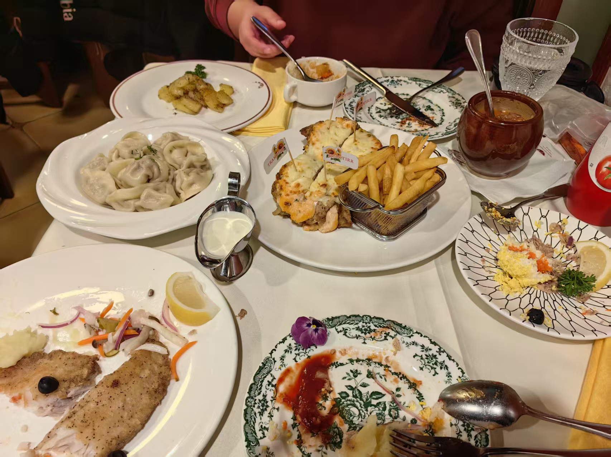
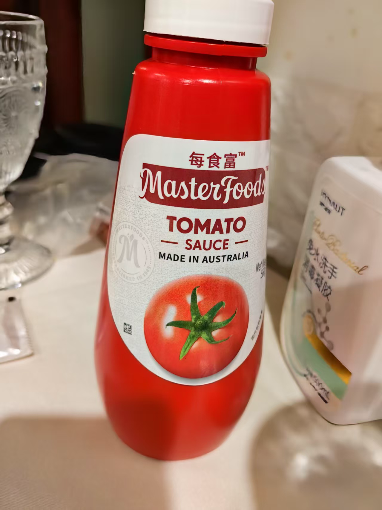
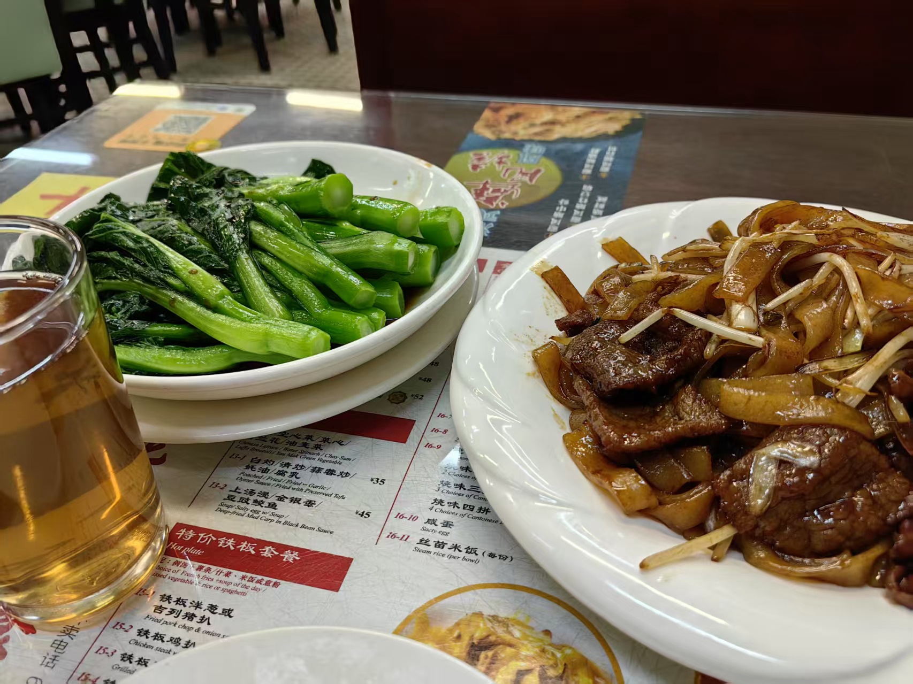

# 北京探店「美食篇」

&nbsp;&nbsp;  halo guys，好久不见。今天我又来了，今天我想和你分享的是北京美食。从去年8.7来到现在，我已经在北京代了半年了。
我和我的同学和实习搭子吃到了好多美味😋，现在我来和你分享三家我认为不错的店。其实吃的店很多，但是不够特色我就不分享了。五道口的美食已经被我吃光了，嘿嘿😁。

## 第一家
我现在心中的No.1：“老井俄罗斯餐厅”。首先别的不说，先说价格，在北京两个男生吃到撑只要200块钱，而且吃的全吃肉🥩，这太爽了。
我来给你看看照片。     
&nbsp;&nbsp;  这一餐里面我们吃了，煎鱼、瓦罐牛肉、猪肉排、俄罗斯饺子、烤土豆、金枪鱼沙拉。其中我最最推荐的是，猪肉排和煎鱼，尤其是煎鱼。
对于一个常年在广东吃海鲜的广东人来说，在内陆城市吃到新鲜的鱼真的是奢求啊😭😭，而且还这么好吃。煎鱼肉质软而绵密，表皮微焦，但鱼肉包含汁水。
鱼肉入口只要轻轻一抿就会瞬间化开，淋上柠檬汁，给鱼肉增加一份清爽。对于鱼排来说，这次这个俄罗斯做法真的让我大吃一惊。在广东，我们一般吃煎鱼的话又两种。
一种是鱼炸透，吃酥脆的鱼，另外一种是将鱼煎至表面金黄，做法与“老井”的类似，但是是整条鱼直接下锅，更加保留了鱼肉本身的鲜味。所以这种鱼排类的做法属实是打开了我的新世界大门，真的很香。   
&nbsp;&nbsp; 再然后就是猪排🥩，那个猪排简直无敌了。猪排一共两大块，一块里面有两层，中间夹着焦糖洋葱、芝士，酸黄瓜，一口下去，猪肉排的紧致，芝士的香浓直冲鼻腔，
紧接者是酸黄瓜和洋葱的清爽。哇，这个口感简直无敌。关键是这个猪排巨便宜，性价比直接拉满。对于这个猪排，我通行的实习生搭子对这个评价巨高，嘿嘿😁。   
&nbsp;&nbsp; 再然后就是你们看到的饺子、土豆🥔、牛肉这些，其中我再点评一下这个土豆🥔。不得不说，俄罗斯人做土豆是真的很厉害。这个土豆奶香奶香的，然后又有煎烤的香味。就是这样一个看似清淡的菜但是味道着实让人惊艳。   
&nbsp;&nbsp; 最后让我来告诉你那天的MVP，是蕃茄酱🥫。这个蕃茄酱香到不行，那天晚上我吃啥都沾一下，然后每一口都能最大激发食物本身的鲜味。我贴个图片，大家感兴趣的可以自己去买，真的真的真的很香。
这个蕃茄酱比亨氏蕃茄酱还要好吃。   
          

## 第二家
&nbsp;&nbsp;  第二家是“黑山烤房”。这是一个在偏远山区里面的美式BBQ烤肉店，那天我们开车过去开了1个小时，是真的远啊。但是不得不说，这一段付出是有价值的。话不多说，先上图片。   
     
&nbsp;&nbsp;  那天我们去晚了，我们只吃到了牛胸肉，没有吃到猪肋排，猪肋排卖光了🥲，非常可惜。但是光一个牛胸肉都足够让我觉得惊艳。这个牛胸肉不柴，真的一点不柴。
整一块牛胸肉呈现三层样式，中间是软烂的，外面两层是焦褐层，散发着炭火香气。整一大块牛胸肉，又软又烂，轻轻一丝肉都化了。然后配上店家秘制的蓝莓酱，甜甜的味道和牛肉的咸香对冲产生奇妙的味蕾反应。
第一次吃这种组合，很是新奇和美味。   
&nbsp;&nbsp;   然后是旁边的小菜，看到那个炸的了吗，那个是炸豆角。这个也是很新奇的做法，豆角一口一个嘎嘣脆，有点像零食，很是不错的口感和味道。然后那个酸黄瓜也不错，很脆很清爽。

## 第三家
&nbsp;&nbsp;  但三家是“北京龙记茶餐厅”。没错，这是一家粤菜店。那天也是想吃粤菜了，就去吃了个粤菜。在网上寻寻觅觅半天找到了这家“北京龙记茶餐厅”。    
      
&nbsp;&nbsp;  就冲这个样子，就冲这个青菜和干炒牛河，我就坐不住了（ps 杯子里的是茶水不是啤酒啊，我不喝酒的）。白灼菜心非常新鲜，味道很甜，淋上酱油，还是那个熟悉的味道。
我一个人就吃了一整盘青菜🥬，我是一个青菜党，我巨喜欢吃青菜。在广东环境的影响下，餐餐都要吃青菜，你们知道我在北京吃不到青菜的日子里过的是有多难受吗😭😢。   
&nbsp;&nbsp;  再然后就是干炒牛河，这个牛肉，这个河粉，要是豆芽再多一点将完成绝杀。这一份干炒牛河虽然比不上广东的路边摊，但是也是炒的相当不错了。牛肉很厚实，河粉充分的吸收了调料。
整个味道已经还原了广东干炒牛河的80%，要是牛河再烫一点然后天气再热一点，就好了，那就真的像是回到广东了😭。

## 总结
&nbsp;&nbsp; 北京，一个寒风刺骨的地方，这些惊艳的美食让我在北京的独居生活感受到了温暖。我是一个几乎没有什么生活的人，我为数不多的有着一点点执念的地方就是吃饭。虽然平时吃的比较随意，但是一旦我想好好吃饭，我就想去吃那些令人惊艳的美食，无论有多远。
小时候，我爸妈就会开车带我去广东的山庄里面吃农家乐，那个是绝世无敌的美味。可能是收到这种广东美食文化的熏陶，我才会对美食有着自己的执着。    
&nbsp;&nbsp;  对于美食探店我会一直坚持下去，不单单是想吃好吃的，更多是给自己保留一点“生活”气息。作为一个单枪匹马冲进后端开发岗位的卷王，我已经习惯让自己保持高压状态，并乐此不疲。
但是我也渴望在闲暇的时候，能够享受生活。对于我来说，租辆车去到美食店，饱腹一顿，就是享受生活了。   
&nbsp;&nbsp;  那么这次的分享就到这里，我们下次再见👋
