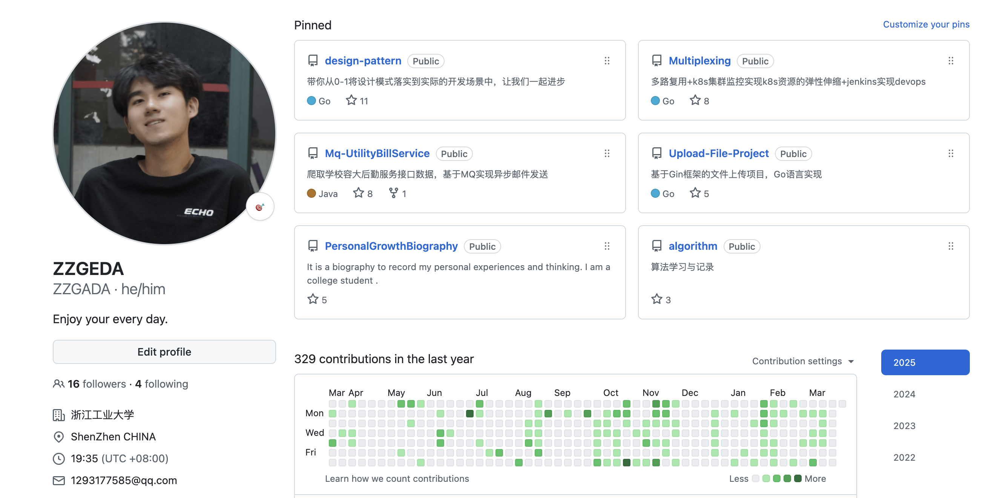
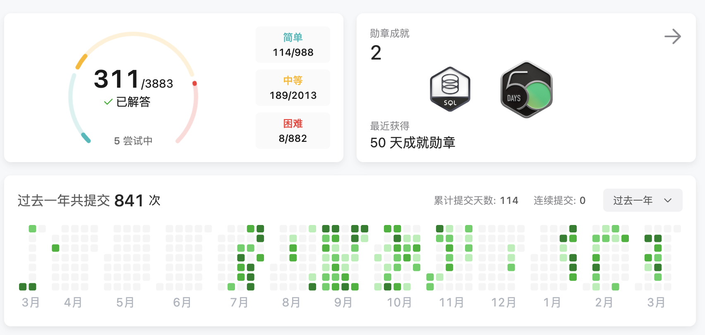

# 2025.03.24 本科阶段的求职任务正式结束

&nbsp;&nbsp; 大家好啊，好久不见，距离上一次记录也已经过了一个多月了，最近的你们过的怎么样呢？我过的不错，我现在人在广东的家里，准备启程返回杭州。   
&nbsp;&nbsp; 我相信看到我此次帖子的标题各位也就知道我要说什么了，是的，我的本科求职流程已经全部结束了。
或许你很好奇，我不是已经拿到offer了吗，为什么还要继续春招？这是因为想给自己多一个选择，同时也希望自己可以进到自己梦寐以求的大厂里面。
但是事与愿违，我还是没能成功进到大厂里面。春招投递的公司美团、网易、拼多多、阿里、快手、京东、字节、腾讯、小红书，现在春招招聘已经全部流程终止。   
&nbsp;&nbsp; 对于上面这个结局我已经有所预料，所以并没有特别难过或者可惜。但该有的失落感还是有的，因为上面的大部分公司除了快手，我连面试的机会都没有。
其中网易笔试4题我a了3道结果被判为笔试不通过，这让我难以理解。 是我能力不够出众？是我学校太差？是我管理学院背景的信管专业？我想究其根本还是我在右边👉[2024.11.07 收到OFFER后的思考和迷茫](/2024/11/1107.md)这篇文章里面说的： **“我是一个双非非计算机科班的本科生”**。    
&nbsp;&nbsp; 对于上面的结果我是昨天晚上知道的，我把我投递的公司流程都看了一遍，然后知道了这最终的结果。知道这个消息后，我晚上出去跑了个步，放松了一下，没有让自己沉浸在这个悲伤的氛围里面太久。
今天提笔写一篇博客是给我的本科求职历程画上一个圆满的句号。   
&nbsp;&nbsp; 在过去的两年时间里，我花了2年半的时间修完大学四年的学分，然后从大三上开始实习一直到今年的2月份。这一段路程没有人比我更加了解其中的艰难与孤独。
一个人慢慢啃计算机基础4大件（计组、OS、计算机网络、数据结构），刷算法（leetcode现在刷了300多道了，不然网易的笔试我也做不出4道a三道，美团3道a两道），独自在杭州、上海、北京三个地方实习积累经验，看面试八股文，框架源码，将设计模式运用到实际的代码开发中。对于开发，我已经做到了我能做到的极限。
所以对于这样的一个结果，说不难过是不可能的，但是我绝对对得起我自己过去的4年时间。我从一个懵懂的计算机开发小白，到现在在好未来部门内能独当一面承担起一个功能模块的开发任务。天道酬勤一直是我的信仰，我将自己的努力转变成了年薪30w+的offer薪资。这其中唯一的遗憾就是没有进大厂。     
&nbsp;&nbsp; 回顾我的过去，我一直带着一种愤怒前进，因为有太多看不起我的人。他们的啼笑皆非，肆意嘲笑都成为了我前进的动力。我一直都渴望自己出人头地，将自己在计算机领域积攒下的成绩摔在这些嘲笑者的脸上。事实证明，我做到了，但是没有彻底做到。大厂是最终的临门一脚，也是我最想证明的地方。
可惜现实是残酷的，在校招招聘流程中，学历和背景还是占了很大的比重。经过了一个晚上，我也终于接受了这个事实，并和自己和解。    
&nbsp;&nbsp; 对于未来的日子会是什么样子的呢？我依然会在计算机领域内不断努力，比将自己的产出转换为业务的实际收入。同时我将我的愤怒转移，转移向了大厂hr。我将不断进步，成为计算机领域内出色的人才，再次向这些看不起我的人（hr和面试官）证明：学历刷掉我也好，简历刷掉我也好，我全都不在意，因为我终有一天会站在你们面前，证明你们全是错的。   
&nbsp;&nbsp; 今天这篇文章就是我本科求职阶段的最终章。今天以后我将不再关心我本科阶段的求职目标，转变为搞好毕设，搞定毕业，享受最后的校园时光。
同时也想跟大家说，我不后悔自己做的选择，认可自己一步一步走到今天所付出努力。我将持续努力，不断前进，在AI时代下书写自己的画卷。
------  
👇是我四年的努力
1. **Github项目**

2. **leetcode 300道题目**
