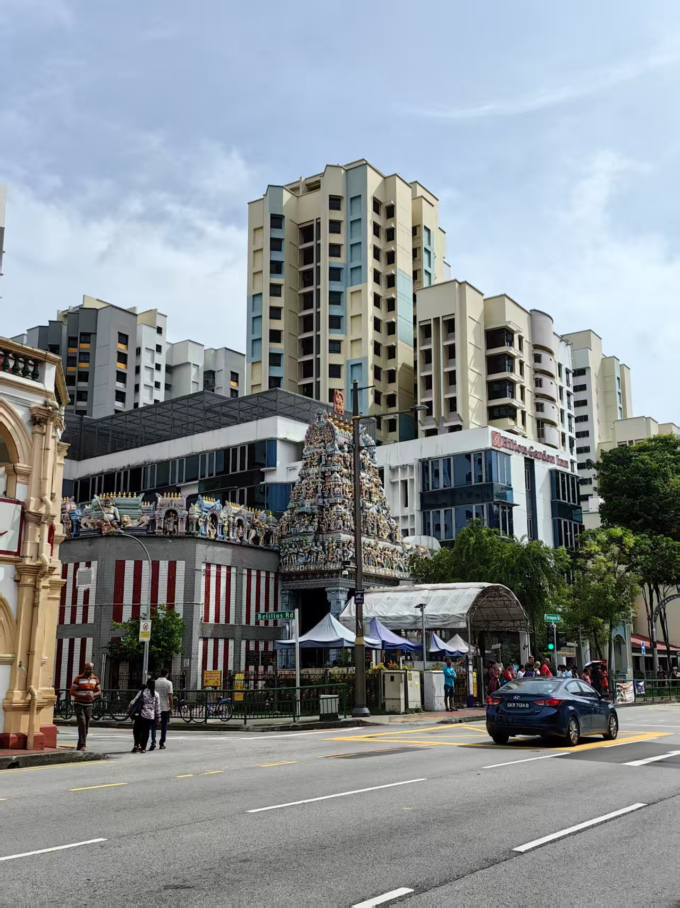

# 新加坡之旅 🇸🇬

## 回顾
&nbsp;&nbsp; 哈喽啊，各位，好久没见了啰。现在是北京时间的2025.06.27号，我现在人在北京的好未来大楼，
准备在北京正式开始我的第一份正式工作。今天我是来补债的😭😢，这段时间玩的是在是太疯了，完全是忘记了要提笔记录这回事。
所以今天来就是好好回顾一下我大学本科期间最后第一次放松时间了😌。   

&nbsp;&nbsp;  这次出去玩的地方是——新加坡 Singapore 🇸🇬🇸🇬🇸🇬🇸🇬🇸🇬    

&nbsp;&nbsp;  先让我来讲讲此次的行程安排。
此次行程安排是5.21～5.24四天三晚的小小特种兵之旅，平均步数都在3w+🚶🏼🏃🏼。
其中主要的游玩时间是5.21、5.22、5.23三天，5.24呆在樟宜机场（Changi Airport），然后飞回中国（5.24早知道机票再买晚一点了，世界上最长的机场滑滑梯都没玩到🥲）。
在前三天的时间里，我主要游玩了三个大核心区域，分别是：滨海湾市中心、圣淘沙岛、苏丹回教堂区域。
虽然说时间很短，但也确实把改玩的都玩到了。     

&nbsp;&nbsp;  这趟旅程是独自一人的世界探险，那么跟上我的脚步，我们一起出发吧🛫👍🚀🏖️🌆。  

## 启程
  

&nbsp;&nbsp;  此次来回机票乘坐的都是国外航空公司，算是刷新了一次不一样的乘机体验✈️。
记得刚上飞机就感觉不一样，周围不再是熟悉的中国人面孔，而是世界人种。
飞机上有皮肤稍黑，毛发旺盛的南亚名族，有背着大旅行包的白人背包客，也有我们这种飞赴东南亚中国旅客（但只是少数）。   
&nbsp;&nbsp;  大家看我5.21号的两张机票，我需要在吉隆坡极限1小时中转😂😂😂😂😂。
当我知道我在广州的飞机延误30分钟后起飞的时候，我的内心其实是有点绝望的，我想这下估计要赶不上了。
所以当我7:40左右在吉隆坡机场下飞机之后，我就飞奔冲向c4登机口，当时我就祈祷，“一定一定要赶上啊”。
然后你们就会看到一个人在吉隆坡机场的C区域撒腿狂奔，周围好多人都看到了，好尴尬，好尴尬，啊啊啊啊啊。
然后过安检的时候，也是好尴尬，我想直接冲向飞机，完全忘记要安检了。
刚刚一进那个安检门，就被安检小哥拦了下来，说“security check sir”，然后紧急回头，疯狂把身上的东西丢进安检机。
最后安检完，检票完也是顺利登机了。然后就是安安心心的享受飞行的风光，顺利到达新加坡🇸🇬。  
&nbsp;&nbsp;  在飞机上我还看到了壮观的马六甲海峡，在下面👇。

## 开玩第一天5.21 
&nbsp;&nbsp; 落地新加坡，我就按耐不住自己的激动，对周围的一切充满好奇。左看看，右看看。
但是下飞机的第一件事就是找地方接水，早就听说新加坡买水超级贵，所以我果断先在机场装满了我的水杯。
（但其实水贵也只是在便利店买贵，如果去超市买水的话就和国内的价格一样，我后面都是在超市买的水）。   

&nbsp;&nbsp; 刚刚到机场，怎么能不先去看看大名鼎鼎的樟宜机场呢？于是我坐上机场小火车，马上出发。

&nbsp;&nbsp; 这个大瀑布其实在一个大商场里面，但是商场和机场是绑定的，所以就变成了世界上机场内最大的瀑布。
从这个角度去看，确实很壮观对吧。第一次亲眼目睹眼前的场景的时候我就直接“哇”出来，也是很难想象，这样一圈热带植物🌴怎么能和这个商场如此契合。
但是要额外提醒一嘴，靠近瀑布的地方水汽充足，没有什么冷气，所以会感觉有点湿热。  
&nbsp;&nbsp; 在看完这个瀑布之后，我就马不停蹄的前往China Town 中国街（这里是我住的地方），正式开始我的新加坡之旅。  

   

  

&nbsp;&nbsp; 如上就是China Town的著名景点了——佛牙寺。这里需要讲一下新加坡的历史，新加坡是从一个港口城市发展来的，曾经被英国殖民，最后解放独立。
曾经的新加坡是马来西亚的一部分，但是无奈之下与马来西亚分离，最终成为一个独立的国家。
在这样的背景之下，新加坡收到了世界上多个宗教和文化的影响，所以你基本可以在新加坡这个国家看到世界上的所有特色缩影：
佛教、伊斯兰教、基督教、印度教，然后各种特色建筑，各人种、种族的人。毫无疑问新加坡是世界的一个小小缩影（再次感谢李光耀先生对新加坡付出的卓越贡献）。  

&nbsp;&nbsp; 哇，当时可把我饿坏了，一到China Town我就到旁边的麦士威食阁寻觅美食。但是好可惜啊，没有吃到“天天海南鸡饭”。
这家店在麦士威食阁超级爆火，排队的人实在是太长了，没有办法，我只能遗憾弃之😭😢。但是也是吃到了很不错的海南鸡饭+叉烧。
幸好老板是华人，不然我还真不知道叉烧的英文是什么😂😂😂。

&nbsp;&nbsp; 吃完饭后稍作休息，我就开始更近一步的探险，启程滨海湾环线。  
 
滨海湾环线是新加坡旅游的中心，位于市中心正中间。著名景点有鱼尾狮公园、滨海艺术中心、金沙酒店、滨海湾花园。
我应该是下午5:00左右到这里的，然后一直呆到晚上8:30。话不说多说直接上超片。   

| Bay                                                                            | Bay                                                                            |
|--------------------------------------------------------------------------------|--------------------------------------------------------------------------------|
|  |  |
|  |  |

&nbsp;&nbsp; 真的这个地方只有你真切实地的来了，才能感受到眼前带来的震撼，这个是其他亚洲国家完全比不了的。
当前世界人种和国际性都市出现在你的眼前的时候，你会有一种错觉，原来这才是世界本来的面貌。
餐桌的周围坐着的不再是来自哪个小区或者来自哪个城市的人，而是来自哪个国家的人。大家皮肤不同，语言不同，但是在那样的一个瞬间却能坐在周围共同享受一样的美食和眼前的风景。  
我记得还发生一件有意思的事情。当时我在鱼尾狮下面准备拍照，然后一眼突然和一个男生对视了，然后就马上走上前来说 “bro，can you help me take a picture. ”
我想应该因为是我是一个纯亚种面孔，然后有一种亚种人很会拍照的错觉😂😂😂😂😂。他们两个男生和一个女生一起在那里摆动作，我一直说“another pose，one more，one more”，那个场面真的好好笑。

&nbsp;&nbsp; 然后离开了鱼尾狮公园我就慢慢悠悠的走到对面的金沙酒店商场，吹了吹空调。稍作休息就前往下一个地点——滨海湾公园。    

&nbsp;&nbsp; 在那里我看了三个景观，分别是“Cloud Forest”、“Flower Dome”、“天空树表演”。话不说多说，先上照片。   

| 滨海湾花园                                                                          | 滨海湾花园                                                                            |
|--------------------------------------------------------------------------------|----------------------------------------------------------------------------------|
|  |    |
|  |    | 

&nbsp;&nbsp; “Cloud Forest”、“Flower Dome”好贵😭，但是里面真好好好看，而且空调好凉快。
“Cloud Forest”这个室内垂直花园，真的很震撼。整体是一个侏罗纪公园的主题，所以会有很多特制的恐龙、昆虫和动物。
“Flower Dome”就是一个有着各大洲特色的植物，旱的、寒的、热带的、温带的在这里都能找到，这里面真的好漂亮。
这里也要一个有意思的事情，我本来是不想去“Flower Dome”的，但是从“Cloud Forest”出来之后发现距离看天空树的表演还是有1个多小时，于是我就决定去“Flower Dome”了。
但关键是这两个地方是有一个套票的，两个一起去会便宜一点，但是我只买了一个嘛，如果再去另外一个，就要多花的钱肯定比套票的多。
所以我就和售票的印度小哥聊了一下，问问可不可以补个差价直接进去。你说巧不巧，刚刚好可以，感觉我是发现了一个隐藏副本。然后我手背上被按了一个印章，就直接进去了。
我还很潇洒呢，我过“Flower Dome”检票口的时候，我指着我的手背说“i get this”😌，然后就进去了。

&nbsp;&nbsp; 最后逛完这里就去看天空树的表演。 那个表演是一个灯光秀，天空树外面的灯光会随着音乐的变化而发生改变。
表演期间放的全是音乐剧的歌，有《马戏之王》的《Never Enough》，《歌剧魅影》的《The Phantom of The Opera》，还有啥我有一点记不清楚了，但是效果很惊艳。
那边有一个大草坪，周围都是不同国家的人，那种感觉，很奇妙。  

当晚我就随便吃了点就回去了，可把我累坏了。

## 5.22 圣淘沙 + 市中心闲逛
&nbsp;&nbsp; 这一天真的是暴走的一天，从早走到晚，但也是很幸运的一天，想玩的都玩到了。   
&nbsp;&nbsp; 圣淘沙是一个小岛，是亚欧大陆整体最南端的一个海岛，在新加坡的开发之下，现在圣淘沙岛是一个游玩圣地。
像环球影城啊，还有各种游乐设施，酒店啊在岛上都一应俱全。那一天我就在岛上呆了一个一天。

| 圣淘沙                                                                            | 圣淘沙                                                                            |
|--------------------------------------------------------------------------------|--------------------------------------------------------------------------------|
|  |  |
|  |  |

&nbsp;&nbsp; 左上方就是圣淘沙著名的歪脖子树，我记得这个树的形成原因还是我当年高中学地理的一个考题，没想到这次亲眼看到了。 
然后右上角就是“亚欧大陆最南端”看到的风景了，椰林树荫，毗邻着繁忙的马六甲海峡，能够远远看见川流不息的巨轮船🚢。
我记得当时站在那里看远处的风景的时候感慨很深呢，从来不曾想过，我居然真的有一天独自一人前往了世界的一个角落。

&nbsp;&nbsp; 然后这里我就要说说左下角的这个图了，这个是“天际滑坡”。这个滑坡车是在一个半山腰上，人可以骑着这个小车从山顶滑倒山下。
整个过程巨刺激，一共有四条道，每个道路都有自己的特色。有最速滑道，有最长滑道，有最简单滑道。但是我自己搞错了，一共四次滑行体验，我有两次滑成同一条了，有一条道路没体验到🥲😭😢🥺😩。
真的可惜啊，留了一点小遗憾。   

&nbsp;&nbsp; 然后我还玩了一个索道，可惜那个我没有拍照，好刺激。人吊着索道从山顶滑下来，滑到海滩上，全场滑了可能差不多40s。
在索道上的感觉好棒，感受海风席卷而来，看见脚下的树林快速离我远去。那个感觉太爽了！！！！ 唯一的问题就是太贵了，花了我300RMB，要是便宜一点，我高低要多滑几次。

&nbsp;&nbsp; 整个圣淘沙就是一个巨大旅游圣地，整个南海岸都是洁白的沙滩🏖️，好多外国人都直接下海去游泳了。遗憾自己没有带泳裤啊，这个地方游泳也太惬意了。
那个海水🌊超级清澈，😢🥺什么时候中国的海不要那么有那么多的泥沙。   

&nbsp;&nbsp; 此次圣淘沙旅程在去完“亚欧大陆最南端”后结束，最后坐着环岛小火车和海岛捷运走了。
告诉你们一个小tips，上岛的时候如果从vivo city直接坐捷运，那么要花费4新币，但是如果在岛内捷运和直接坐捷运出岛都是不要花钱的。
省钱小妙招上线。   

&nbsp;&nbsp; 圣淘沙玩完之后我就直接回China Town了，直接去“松发肉骨茶”吃下午餐😂😂😂😂。午饭没吃，直接去吃下午餐。
你说巧不巧，刚刚好不用排队。   

     

&nbsp;&nbsp; 我点了一个肉骨茶和一个牛肉。那个肉骨茶，确实好吃。整体胡椒味很重，肉不柴，但是没有脱骨，我想应该不是用高压锅压出来的。
然后就是左边的那个牛肉，那个味道很不错，适合广东人的口味。那个时候可真是给我干饿了，框框一顿狂吃。吃完还去了旁边的麦当劳，又加了一个餐。😂😂😂

&nbsp;&nbsp; 到了晚上我就去克拉玛依港口转了一圈，由于那边都是酒吧喝酒的，我简单绕了一圈就离开了，我不喝酒，所以觉得没啥意思😂😂😂。
但是旁边的一家吃螃蟹的店很吸引我，可惜我一个人吃的话吃不完，有一点不划算，看来一眼菜单被吓到了，就直接走了😂（好贵好贵）。  

&nbsp;&nbsp; 最后奉上一张警察局的照片。这里我第一次去是晚上看到的，拍出来效果不好看，看不到这些不同颜色的房子，我就在23号下午路过的时候重新拍了一张。
这里怎么说呢，我不太清楚历史是什么样子的，就只觉得好看，适合想出片的人来这里拍照。照片在下面👇
 

## 5.23 苏丹回教堂 + 小印度 + 博物馆

   

&nbsp;&nbsp; 旅行的最后一天就比较惬意了，最想看到的和最想玩到的都在前两天体验了。剩下的就是慢慢走走，慢慢体验了。
所以旅行的最后一天我就选择去了小印度和苏丹回教堂。但由于我本人对于宗教不是很感兴趣，所以就在这些街区转了一转，体验了一下当地的风俗。
&nbsp;&nbsp; 小印度是新加坡印度人的集中地，这一块区域居住着的基本都是印度人。去这里也主要是想体验一下印度风情，想品尝一下特色美食。
但是很奇怪，我脑子里对于“印度美食”的评价都是不太好的，当我看到实物之后，我也萌生了退出的想法。所以最后也就没有体验了😂😂😂😂😂。   

&nbsp;&nbsp; 接下来就是步行去苏丹回教堂了。对于这个地方我还蛮喜欢的，非常有艺术气息和生活感。墙壁上都是很有意思的图画，然后也在这里吃了一个印尼菜。
虽然我看不懂教堂的美和历史，但是亲眼看见教堂的时候还是很感触的。下面👇是照片。   

| 苏丹回教堂                                                                          | 苏丹回教堂                                                                          |
|--------------------------------------------------------------------------------|--------------------------------------------------------------------------------|
|  |  |
|  |  |

&nbsp;&nbsp; 强烈推荐左下方这个饼，这个好好吃。我点的馅料是肌肉的，还有鱼肉和牛肉的。这个饼感觉像是变厚重了的鸡蛋饼加肉饼，味道好香，而且吃完一个好顶饱。
然后还有右下角那个饭，我点的是牛肉饭，应该是印尼菜的一种做法，味道也不错，但是有点辣，我有点适应不了😂😂😂😂。   

&nbsp;&nbsp; 后面吃完之后我就坐公交车慢慢回China Town了，下午的新加坡实在是太晒了，要被热化了，所以我果断选择睡觉🤣😂。   
&nbsp;&nbsp; 等太阳不那么强之后，我就最后在到市中心走了一圈，去了亚洲文明博物馆。你说赶巧不赶巧，我去的时候刚刚好免费，而且还能看特别展。
哇，真是给我撞大运了，又是美滋小蹭到了。 可惜毕竟新加坡的历史不够悠久，缺少历史文化的沉淀，所以展品的历史性和观赏性还是略微欠佳，
但依然看见了历史人民在过去留下的时代印记。

| ACM                                                                            | ACM                                                                            |
|--------------------------------------------------------------------------------|--------------------------------------------------------------------------------|
|  |  |
|  |  |

&nbsp;&nbsp; 最后的最后就是逛完ACM亚洲文明博物馆之后就已经黄昏了，我就想最后去鱼尾狮公园转了一圈。在前往鱼尾狮的途中，刚刚好看到了一个露天音乐会。
演唱的是三位小朋友，负责伴奏的是一个小乐团，大家一起演奏演唱了一首宫崎骏先生的电影的“悬崖上的金鱼姬”的主题曲。
在蓝调天渐暗的时候，看到这样的一个画面，真的有一种很惬意很幸福的感觉🥰😌。    

[可以点这里查看视频哦,但可能视频有点模糊](../../ZZGEDA/ggMemory/singapore/VID_20250523_193655.mp4)    

## 5.24 回家
&nbsp;&nbsp; 最后就是回家了，那天在樟宜机场走了走✈️，吃个了麦当劳🍔，我就乘机飞回家了。  

&nbsp;&nbsp;  给大家放一张夜晚的金沙酒店

## 小小总结
&nbsp;&nbsp; 小小总结一下把，此次旅程属于是一次突发奇想吧。当时是5.10号左右，我已经忙完了学校的所有事情，所以就想着回家了。
但是问了周围一圈人，发现我的好朋友都还没有回深圳。秉持着绝不浪费时间的想法，既然没有人陪我玩，那我就自己溜达溜达。所以就有了出发去新加坡的打算。
结论证明，这确实是一次不错的旅行，我第一次用自己的脚步亲自丈量了完整的世界，第一次亲自感受多色人种的环境和氛围，也是第一次如此勇敢地、毫无顾虑的出发。
新加坡这个国家很好，既有大都市的繁华，也有温暖的人情。作为亚洲的互联网和金融中心，新加坡以自己的能量辐射到了整个亚洲和整个世界。
当我行走在新加坡的市中心的时候，我看到了中国银行、字节跳动、微软的分部大楼，那个时候我多多少少有幻想过我是否可能在这里工作呢？
当然这不是一个问题，而是一个引子，或许在遥远的未来，我真的会迎来这一天，但是谁又知道呢？

PS：（关于上文的最后一句话，我想额外补充一下，下面是我想对你说的话：
不知道你会不会看到这里，如果看到了，也请不要多想哦～ 如果在那个遥远的未来我依然是自己一个人的话，我才会去考虑这样的一种可能。但如果我已经找到了那个她的话，那就让这种不切实地的想法埋葬吧。没有什么是比那个人更重要的了）    

&nbsp;&nbsp; 啊，终于写完了，写了一天了，终于把欠下来的债补起来了。  
&nbsp;&nbsp; 那么新加坡🇸🇬，我们下次再见👋
