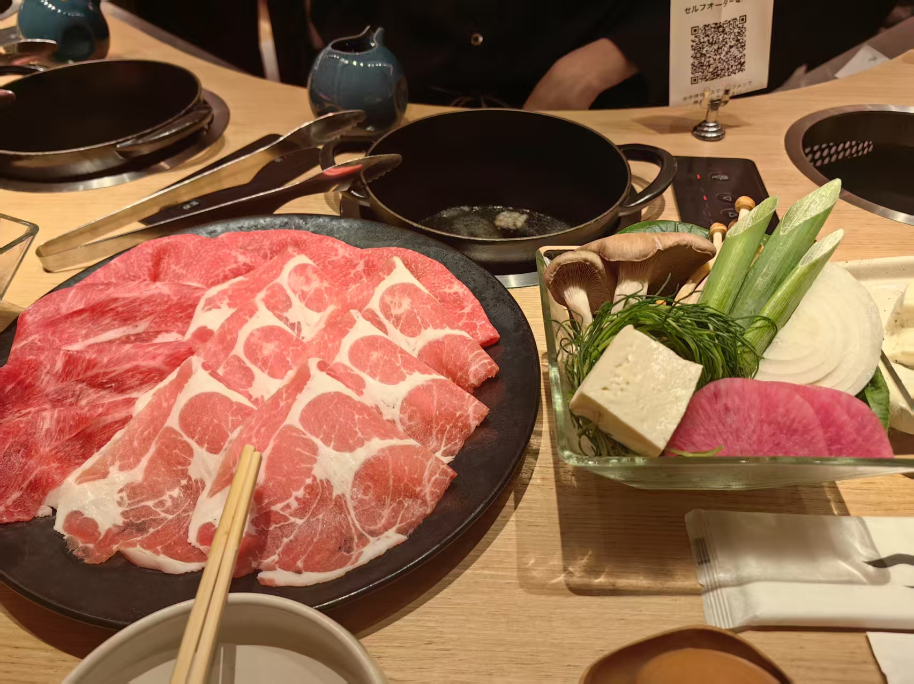
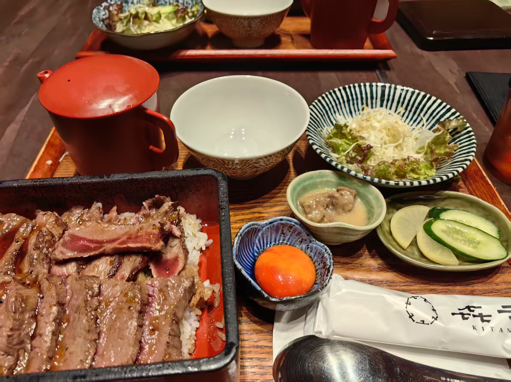

# 日本之旅 🌸

## 激动人心的日本之旅开始了 

&nbsp;&nbsp; 大家好，这里是ZZGEDA，书接上回的《新加坡之旅》，这次想和你分享的是我本科阶段最最最最最喜欢的一次旅行——日本行。
这次旅行真的真的非常开心，而且令人难忘，我想过了很多年之后我也依然会记得这次旅行的经历和我当时的感动。 😆😁😄🥹  

&nbsp;&nbsp; 本次旅行我做足了攻略，一方面是想在我本科阶段的最后时刻充分利用时间，再好好得无忧无虑地玩一次；
另外一方面是想给和我同行的人留下一个难忘的经历和回忆。
正如我在[2024.11.9 环球影城-北京🎠](/2024/11/1109.md)👈这篇博客中最后一段写到的一样，“出去玩，做什么事情，这不是最重要的事情。重要的是和谁一起，毕竟这是属于和我一起出去玩的人记忆”。  

## 开始
&nbsp;&nbsp; 此次旅行是一次为期10天的远途旅行，我将先后抵达大阪、京都、宇治和冲绳四个地方。
旅行全程分为两个部分，分别是6.9～6.15号的关西之旅和6.15～6.19的冲绳之旅。
旅行后半程的冲绳我是和我的家里人一起玩的，而前半程的关西之旅我是和我的好搭子一起。
虽然按照时间顺序来说🤔🤔，我应该先从关西之旅开始讲起，但是由于关西之旅现在给我留下了很深的印象，我想采用倒叙的形式跟你来一起分享😁。  

&nbsp;&nbsp; 那么话不多说了，跟上我的脚步👣，和我一起探索世界地图🗺️。

## 冲绳之旅
&nbsp;&nbsp; 冲绳，一座位于日本西南部，中国东部的海岛🏝️。
这里有着浓厚的热带风情和最亲近的自然，清澈的果冻海，碧绿的丛林都是这里的代名词。
我和我的家人是2025.6.15号下午在冲绳那霸机场会和的，然后我们坐车一路向北，抵达冲绳的本部町。
说来也是搞笑，由于我们抵达冲绳住处的地方已经是晚上的8:00了，所以我们落地冲绳的第一餐吃的是全家便利店，哈哈哈哈哈🤣🤣🤣🤣🤣。
当时三个人，我妈、我姐和我，三个人冲进便利店，像蝗虫过境一样，把便利店席卷了一边。我姐是真的饿坏了，哈哈哈哈哈，买了好多东西。
最后三个人拎着大大小小的袋子回住的地方了。回到住的地方，就开始把买的东西都放进微波炉，坐等开吃。   
&nbsp;&nbsp; 我姐也还是老样子，等我反应过来的时候，我姐就已经打开pad，边看电视边吃饭了，速度之迅速💨以至于完全没有反应过来。  
&nbsp;&nbsp; 当然了，这也只是我们到冲绳的第一天，重要的行程还在后面。    

&nbsp;&nbsp; 好啦，当时间来到冲绳的第二天，我们的冲绳之旅就正式开始了，2025.06.16我们去的是“冲绳美丽海水族馆”和“備瀬海岸”。
水族馆我去过好几个，但是在离海这么近的水族馆还是第一次去。整个“冲绳美丽海水族馆”的面积不大，但是水族馆所在的旅游公园很大。
在公园里面可以眺望到超级清澈、湛蓝的海洋🌊。这个感觉真的是相当梦幻了。先给你们分享一下当时我刚到公园看到的景色，真的是绝美。   

| 冲绳美丽水族馆公园                                                                    | 冲绳美丽水族馆公园                                                                    |
|------------------------------------------------------------------------------|------------------------------------------------------------------------------|
|  |  |
|  |  |

&nbsp;&nbsp; 怎么样，怎么样，是不是超级美。真的，这是我第一次见到这么美的地方，第一次见这么蓝的大海。
我记得当时见到这样的景象，我已经无以言表了，这个海真是美的让人窒息。
然后让我来介绍一下，这个头戴蓝色帽子的就是我的姐姐，戴白色帽子的是我的老妈。这次同行去冲绳的家人就是这二位了。   

&nbsp;&nbsp; 然后让我们把镜头切到水族馆，一起来看看这个水族馆是有何种魔力，能让世界各地如此之多的人来到这里。直接上照片。

| 冲绳美丽水族馆                                                                      | 冲绳美丽水族馆                                                                    |
|------------------------------------------------------------------------------|----------------------------------------------------------------------------|
|  |  |
|  |  |

&nbsp;&nbsp;  啊啊啊啊啊啊，好烦啊，为什么这个视频截出来的关键帧会让整个图片颜色变暗啊，受不了了，垃圾华为😡🤬。
不说这个了，还是让我们来看看图片把。

&nbsp;&nbsp;  这个水族馆真不愧是冲绳必来的地方，真的太震撼了。
当庞大的鲸鲨慢慢悠悠地从你眼前晃过去的时候，你会有一种世界都慢下来的感觉。鲸鲨，一个生存率极低的物种，
你很难想象它刚出生的时候才只有一个手掌大小，但现在却能长得如此巨大。鲸鲨是温顺的，是平和的，是不争吵的。
它们以海洋中的浮游植物和虾米为食，对大型鱼类和人类都没有攻击性。它们常年穿梭于各个大洋之间，在湛蓝的海洋里面遨游，迁徙。 
与鲸鱼相比，鲸鲨更加渺小，更加温柔，也因此更令人怜爱。温顺的鲸鲨从来不争不抢，只是慢慢地穿梭在鱼群中间。
如果有什么词可以用来形容鲸鲨的话，我想也就只有“温柔”二字了。或许是某种程度上的心心相映，我总感觉我和鲸鲨很像。
当我在水族馆的正中央看着鲸鲨慢慢地游着，我也仿佛看见了我自己。   

&nbsp;&nbsp; 当然啦，整个水族馆还有其他海洋生物，但是只有这个鲸鲨让我留下了最最深刻的印象。 

&nbsp;&nbsp; 然后游玩水族馆之后，我们就前往了“備瀬海岸”。虽然相比于其他著名的海滩，这个海岸显得那么默默无闻，
但是这里的美也是令人难以忘怀。这里没有什么沙滩，有的只是珊瑚和礁石。
由于缺少沙滩的过渡与隔阂，所以当你行走在礁石旁的岸堤之上的时候，你可以清晰地听见来自远方海洋的呼唤。
那是清爽的海风，不急躁，不执着，只是轻轻地溜过你的发髻；淡淡的海水味会萦绕在你的周围，海浪会敲击着堤岸发出哗哗的声响，略带凉意的海风会裹挟着水汽拂走低纬度的热气。
当时的我找了一个阴凉的地方一坐，就在那里静静地倾听着海洋的秘密。   

| 備瀬海岸                                                                      | 備瀬海岸                                                                    |
|------------------------------------------------------------------------------|----------------------------------------------------------------------------|
|  |  |
|  |  |
|  |  |  

&nbsp;&nbsp; 当天的行程就只有这两个地方，我们没有做过多安排，只是任凭海风吹乱时间的发尾。

---- 

&nbsp;&nbsp; 由于此次冲绳吃的东西都比较随意，所以我就掠过美食介绍的环节。   

&nbsp;&nbsp; 时间来到第三天，这一天我们要去三个地方，分别是古宇利岛、国立公园和冲绳的最北边——边户岬。    
&nbsp;&nbsp; 整天下来，其实可以用一句话来进行总结，“深深感慨海洋的魅力，不光光是透亮的波涛，还有那无边的胸怀” 

| 海                                                                            | 海                                                                    |
|------------------------------------------------------------------------------|----------------------------------------------------------------------------|
|  |  |
|  |  |
|  |  |  

&nbsp;&nbsp; 在上面的图片中，右侧中间的那一张照片就是冲绳岛的最北边了，然后剩余的都是古宇利岛上的风光。
&nbsp;&nbsp; 古宇利岛，一座与冲绳岛紧密相连的小海岛，在这座岛上我看见了最璀璨的大海。
我记得很清楚，当时站在暸望塔上俯瞰全岛风貌的时候，我的内心是感动的，包括我现在也是如此。

--- 
&nbsp;&nbsp; 然后时间到了我们在冲绳的最后一天游玩时间，这一天主要是去看看人文风景，其他也就没有什么了。
去了一个美国村和琉球村，然后做一个简单的观光客，拍了拍照片，也就结束了当天的行程。
但倒是有一个很特殊的事情，嘿嘿。在去完美国村之后，我就跑到无印良品，买了4个本子😁😁😁😁，你知道的。

| 美国村                                                                          | 美国村                                                                          |
|------------------------------------------------------------------------------|------------------------------------------------------------------------------|
|  |  |
|  |  |
|  |  |  

----
## 冲绳总结
&nbsp;&nbsp; 简单做一个冲绳总结把。冲绳，一座美丽的海岛🏝️，一座来了就不想走的海岛。
独特的自然风光，碧蓝的海水，温暖的人情，这里的一切都很好，非常适合老了来过退休生活😂😂😂😂。
离开这里的时候没有不舍，只有赶紧回到杭州的冲动。因为杭州的同学还在等我，马上毕业了🥹🥲😭。
但是这里也依然存在遗憾，总有一天我会再次来到这里，希望那个时候的我会变得不一样。

---- 
## 关西之旅
&nbsp;&nbsp; 关西之旅，3城，7天6晚，一段说长不长，说短不短的旅程。
如果只能用一个词来形容此次旅行，我想用幸福二字来进行概括。跟随我的脚步，让我们一起把时间线拉回到6.9号。
我的好搭子，要开心哦，如果你看到这里的话，可以拿出那个本子翻翻看哦。  

&nbsp;&nbsp; 时间回到6.9号，我和我的好搭子启程出发上海浦东国际机场T2航站楼，准备搭乘11:00的航班前往关西国际机场。
但是，春秋航空啊，春秋航空，算我求求你了嘞🥺，以后飞机上安安静静的好不好啊，我本来睡的老香了，愣是被你吵醒了😡😡，但我的好搭子睡的很香，估计是起太早了，累困了。
但好在准时准点的落地了，而且座位的乘坐空间比国内线宽敞一点，这次就小小的原谅你把，下一次去日本的时候，我还选择做春秋航空，哈哈哈哈哈哈。

&nbsp;&nbsp; 刚刚落地关西机场，我们就被周围日文的环节所吸引。真的在过安检的那一刻，我们才真切实地的意识到，我们终于来到了日本，好激动好激动。
这个时候又想到我去新加坡的时候，一下飞机就是先找水，笑死我了，哈哈哈哈哈。

&nbsp;&nbsp; 很幸运，过关的时候没有任何阻拦，果然是来大阪的游客太多了，如果是去名古屋的话，可能就要被盘问一下。
前前后后过关，加上填写入境资料，再到出机场去到坐铁路的地方，差不多50分钟把，我们就很顺利的来到了JR站台和南海铁路站台处。
再简单快速兑换完我们的JR PASS 和 交通卡之后，我们就正式开始了我们的日本关西之旅。好诶，好诶。

&nbsp;&nbsp; JR PASS 就是那个蓝颜色的券，交通卡就是那个粉红色的那个。

| 准备坐电车                                                                      | 坐上电车                                                                       |
|----------------------------------------------------------------------------|----------------------------------------------------------------------------|
|  |  |

&nbsp;&nbsp; 先来讲讲住宿，我们住的地方在天下茶屋站附近，乘坐南海电车可以直达。
这个站不管是从机场来，还是去大阪市区的其他地方都超级方便。感谢我的好搭子诶，选了这么好的一个地方。
而且，而且，这个民宿超级棒，小小的两层复式，很干净，很温馨，在这里住的每一天都超级开心。
谢谢好搭子你哦，选了这么好的一个地方😆😁。
还要感谢当时我远在吉隆坡的兄弟，借了我Netflix的账号，每天晚上都看视频，太棒了🤪😃。

   

&nbsp;&nbsp; 还记得我们当时第一天晚上吃了什么吗？寿喜锅！🍹🥘香喷喷。
虽然说有一点点小贵，但是饱餐一顿，好幸福啊。唯一有一点点不足的就是味道有一点点甜了，但是听说关西口味都是这样的。
又想起来我还厚脸皮有多要了一碗饭，还有一个鸡蛋。哈哈哈哈哈，笑死我了。吃的后面实在是有一点吃不动了，吃撑了。

--- 
&nbsp;&nbsp; 再然后就是第二天了，这一天我们就正式开始玩啦。那一天，我们的目的地是京都。
一大清早我和我的好搭子就乘坐Haruka列车前往京都车站，还记得我们当时上车还坐错车厢了，被检票的姐姐从第4车厢带到第2车厢去了。
那个Haruka列车外面有Hello Kitty的装饰，还记得吗？嘿嘿，你照片里面有哦。

&nbsp;&nbsp; 抵达京都车站，我们就马不停蹄地前往我们看的第一个景点“清水寺”。还记得去清水寺的路上，那个巴士上的人真的太多了。
旁边的几个日本小哥一直在说“呀百 呀百”，估计巴士司机都有一点烦恼，怎么会有这么多人上车。  

&nbsp;&nbsp; 但也是可惜了，那天下雨，前往清水寺的路线不是特别好走，那天可真是辛苦你了哦。
在艰难的走了好久的上坡之后，我们也终于抵达了清水寺。
其实我对于清水寺的印象还是因为柯南，柯南动画片里面有几集跟清水寺的关系可紧密了。
但是关于我在清水寺抽到的签，嗯嘛，这个就让它过去吧。
&nbsp;&nbsp; 还记得我们选了音羽泉的哪一个泉接水了吗，👇下面这个图片最右边的这个（长寿的）。

| 清水寺                                                                      | 音羽泉                                                                          |
|----------------------------------------------------------------------------|------------------------------------------------------------------------------|
|  |    |

&nbsp;&nbsp; 看完清水寺，我的好搭子肚子就开始咕咕叫了，然后火速开始找吃的。
找吃的途中，我们还去了第一家吉卜力专卖店，然后我的好搭子在下楼梯的时候还不小心摔了一跤。
当时可把我吓坏了，哎呦，老心疼了当时。好在最后顺利吃上了一碗热气腾腾的鸡肉面，真的好好吃，没想到无意间发现的小店这么多惊喜。

| 吉卜力                                                                        | 拉面                                                                         |
|----------------------------------------------------------------------------|----------------------------------------------------------------------------|
|  |  |

&nbsp;&nbsp; 然后就是下午了。下午我们去的是八坂神社、衹园、三条通、六角通这些地方。
重点来讲讲衹园和三条通吧。大概是吃完饭后1个半小时，我们在衹园找了一家咖啡店吃了个芭菲和煎饼。
那个芭菲分量好大，巧克力好甜好好吃。煎饼🥞也是松松软软的，上面还有黄油和糖浆，好好吃。
但当时吃到后面可把我吓坏了，我的好搭子说吃到了会过敏的芒果。当时我毛骨悚然，我说这下完了，赶紧打开手机开始看最近的医院在哪里。
然后马上问服务员，是不是有芒果。你说可不可怕，那个服务员瞎说，她说有。哇，当时我的天一下子就塌了。
但是我不相信，然后我的搭子边在旁边说没有事情的，我就边开始把芭菲里面的水果找出来，看看是不是真的有芒果（主要是我没有吃到，不太敢相信）。
最后结账付款后，我又去找了主厨，让他仔仔细细地看了一下是否真的有芒果。结果结果，这个主厨说没有，说只有黄桃。
哇，我那悬着的一颗心在主厨说出黄桃的时候得到解放。真是把我可吓坏了😭😭😭😭😭😭😭。
&nbsp;&nbsp; 也算是有惊无险了，虚惊一场。 下面👇这个就是芭菲。

&nbsp;&nbsp; 接下来就是三条通、六角通这两个核心商业街了，我看到我的好搭子两眼放光我就知道这个地方来对了。
在这个地方我们逛了好久，买到了好多东西。果然看到什么就买什么这种感觉最棒了。谢谢好搭子你哦，陪我看了那么久的衣服。

&nbsp;&nbsp; 最后逛到最后也是夜快深了，我们刚刚从BookOff出来，在去京都车站上拆了三个谷子。
我的搭子抽到了两个“幽灵公主”，帮我抽了一个“红猪”的，然后也就这样我们就慢慢悠悠又乘坐Haruka列车回到大阪了。

--- 
&nbsp;&nbsp; 时间来到第3天，这一天怎么说呢，感觉我们的运气稍微有一点点的不好，但一切一切的转折都在雨过天晴后有了好转。
那天早上醒来，我们就发现可能有东西落在买衣服的地方了。然后我们就稍微改变了我们原来的行程，回到了买衣服的地方。
最后真的好幸运，果然在买衣服的找到了。当失去的东西失而复得，我想我的搭子当时应该很开心吧。
然后我们就去找东西吃了，可惜在吃饭的时候又发生一点点意外。那个臭味增汤，你往我搭子身上倒是什么意思啊。
让我搭子的衣服都变脏了，再也不去那家店了，哼。
&nbsp;&nbsp; 好在我搭子心态好，后面果断处理后，我们就前往“千本鸟居”⛩️了。那个时候刚刚好雨过天晴，一切都是最好的安排。  

&nbsp;&nbsp; 由于当天的行程没有安排什么东西，所以简单逛过红红的鸟居️️⛩️之后，我们就前往宇治了。
&nbsp;&nbsp; 宇治，一个宁静的小镇。在这里没有都市的繁华，也没有匆匆行人，留下的只有宇治川的安详与宁静与街边店铺飘来的抹茶香味。
或许是雨过天晴的原因，天晴后的宇治变得更加令人向往。当透过云层的金光洒在宇治川上的时候，我感受到的只有悠悠的山野步道和前所未有的宁静。
当天我们去了平等院和宇治神社（宇治神社又叫兔子的神社，是给在山林里迷路的兔子指明方向的）。
我的搭子很喜欢可爱的东西，所以当我们在神社里面看到兔子的雕像的时候，我的搭子可开心了。  

&nbsp;&nbsp;  受制于时间原因，我们要赶回大阪去吃大阪烧，所以宇治没有做过多的停留，但是我想后面还有机会的话，我一定会想来这里多躺几天。

&nbsp;&nbsp; 那天晚上老开心了，我们吃了大阪烧，还去了心斋桥，然后果断买了好多休足时间😂😂😂，在心斋桥留下来很多憨憨的照片，哈哈哈哈哈哈。

| 大阪烧                                                                          | 心斋桥                                                                          |
|------------------------------------------------------------------------------|------------------------------------------------------------------------------|
|  |  |
|  |  |
|  | |  

--- 
&nbsp;&nbsp; 时间来到第四天，那天我们的主题只有一个，那就是：大阪环球影城（USJ）
&nbsp;&nbsp; 那天也真的是玩疯了，园区内所有过山车我们都玩完了，但是就是没有拍照片😂😂😂😂😂。
一直是排队，玩，然后吃，然后玩。在此实名表扬USJ的鸡腿🍗好吃，大家都去尝尝，好香好香。
此次USJ唯一可惜的就是那个倒着玩的过山车没有玩到，这个有点点可惜了。留点遗憾啰，下次再来。

&nbsp;&nbsp; 然后还发生了一个很好笑的事情，我去玩马里奥卡丁车的时候，由于那个机器有问题，我白白乘坐了一次游戏。
但是好在和工作人员的耐心解释，我又获得了重新玩的一次机会。嘿嘿，美滋啦。而且我和我搭子原本是分开玩的，这下重新玩之后，我就可以和我的搭子一起玩了。
真是好运连连🍀🍀🍀🍀。

&nbsp;&nbsp; 给你们看我们在马里奥园区吃的东西，超级好看。

  

&nbsp;&nbsp; 由于USJ只是注重体验的地方，那就请各位自己慢慢玩吧。让我们把时间快进到晚上的梅田蓝天大厦。  
&nbsp;&nbsp; 梅田蓝天大厦，这是一个不去会后悔的地方。如果哪里适合好好的欣赏大阪的全貌的话，我想也就是这里了。
夜晚的大阪的很安静，安静到只能听见远处传来的电车的压过轨道的声音🛤️；夜晚的大阪很美丽，每一个住宅和大楼都是温暖的橘黄色；
当然夜晚的梅田蓝天大厦也是美的令人窒息，露天的荧光步道发出幽幽的蓝光，像是行走在无人的引火虫森林；环形的步道更是能让我们一览大阪的全貌。
如果大阪哪个地方最让我动容，我想大概就是这里吧。不管是第6天离别之夜的再次到来，还是此次夜晚的月下慢行，梅田蓝天大厦都给我留下来难以忘怀的记忆。
关于最后一晚在这里发生了什么，这是我和我搭子的小秘密，不告诉任何人哦😋🤭。

| 梅田蓝天大厦                                                                       | 梅田蓝天大厦                                                                          |
|------------------------------------------------------------------------------|------------------------------------------------------------------------------|
|    |  |
|    | | 

--- 
&nbsp;&nbsp; 时间过的好快啊，马上时间就来到了最后两天。这两天因为下雨，我们就没有按照原定计划去神户了，而是改成在大阪好好玩了。
大阪这个洋溢着自由之风的地方，我真想好好在这里呆上一段时间。   

&nbsp;&nbsp; 你还记得最后两天我们去了哪里吗？我们在心斋桥和梅田附近逛了好大一圈，然后买了好多好多东西。
无印良品、鳗鱼饭、包包、吉卜力、谷子、烧肉、和牛饭，这些都是在最后两天发生的哦，这两天我们每天都是大包小包的往民宿走。
然后还有早上见到的梨花猫，抽扭蛋，泡面夜宵都是这两天发生的。

&nbsp;&nbsp; 这个花我记得哦😊，我很喜欢哦。

| 最后两天                                                                       | 最后两天                                                                      |
|----------------------------------------------------------------------------|---------------------------------------------------------------------------|
|  |  |
|  | |
|  | |

---  

&nbsp;&nbsp; 滴滴，然后的然后就是最后一天了。这一天我们早早来到机场，我要飞去冲绳，我的好搭子要飞回国内。
那一天可真是难忘的一天呢，如果大家有我的朋友圈的话就知道那个时候我在想什么了。
然后在机场发生了什么事情，我也就不告诉你们了，这个我搭子知道就好了。
可惜的是最后坐南海电车来的票被收走了，不然你的本子还能再多一个纪念品。
👇下面附上我的pyq截图。

## 总结
&nbsp;&nbsp; 小小总结一下此次日本之行吧。此次日本行是我和我搭子的毕业旅行，用这样一场难忘的旅行作为我本科阶段的收尾或许再合适不过。
在短短的10天时间里，我先后感受到了大阪的自由、京都的风雅、宇治的宁静和冲绳的风光，但其中最令人难忘的或许还是前7天的关西之旅。
原来一间小小的民宿最后在我的潜意识里面也成为了家🏠的存在，原来大阪城的夜景也会因为身边的人而变得的意义非凡，
原来一碗小小的泡面也会让我感伤良久。   
&nbsp;&nbsp; 行笔至此，无以言表。我只想用开头的话来为此次旅行做一个圆满的收尾“出去玩，做什么事情，这不是最重要的事情。重要的是和谁一起，毕竟这是属于和我一起出去玩的人记忆”。
或许时隔多年，当这篇博客被再次点开的时候，我依然能记忆起当时大阪的那个“家”和现在笔下的感动。  
&nbsp;&nbsp; 最后，我的好搭子，这是写给你的。
很感谢一路走来有你的陪伴，也很感谢4年前那次相遇的契机，如果没有你，我想我的日本之旅也不会如此令人难忘。
我的好搭子，请坚定且自信地大步向前吧，无论未来遇到什么困难，我一直在你身边。  
&nbsp;&nbsp; 期待北海道之旅的到来～   
&nbsp;&nbsp; 天气慢慢热起来了，在家里好好陪陪家人了哦。

