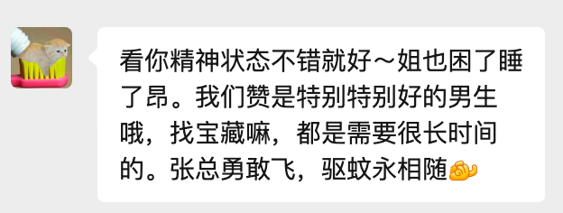

# 遇见到了她

&nbsp;&nbsp; Hello啊，大家好，这里是ZZGEDA。最近的各位过的好嘛，有没有遇到有意思的和开心的事情呢。
我最近是遇到了一些很好的事情呢，今天就来和大家分享一下。   

&nbsp;&nbsp; 但是在正式开始分享之前，还是想先和大家说一下，现在我已经正式毕业了，
正式成为了一名golang后端开发工程师。现在我就职于好未来，正式开启了人生的一下阶段。   

&nbsp;&nbsp; 说来也是感慨吧，恍惚之间，也已经不再是一个学生了，而是正式步入社会，
开始成为一个担负责任的大人。
遥想当初，刚刚进入大学的时候，还是一个懵懂的少年； 现在也是成为了家里人的骄傲，在北京开始奋力打拼。
当我站在人生阶段的这一个节点上，回头凝望自己走过的来时路，真的想感谢自己——“谢谢你，一直相信自己，并一直前进”。
这一路走来，经历了很多的挫折和困难，也有过很多的迷茫和不安，但如今都成为了我人生的勋章，值得骄傲与回忆。
还记得2022年那个因为转专业失败懊恼的自己，或许他完全没有想到自己能够走到今天，会成为后端开发前辈夸奖的对象，也在成长路上结识了许多志同道合的伙伴。
看看那个日日夜夜奔波的少年，也是第一次有了种欣慰的感觉。
当然，站在这个节点，向前望，我清楚地明白这是个新的开始，新的篇章。
我还要付出更多的努力，去迎接未来的挑战和机遇。

&nbsp;&nbsp; 当然，这个时间点不仅仅是属于我自己，也是属于我和我的女朋友。
在2025年7月9日，我和一个可爱的女生在一起了🥰。   

&nbsp;&nbsp; 她有个很可爱的名字，她叫辰轩，和我毕业于同一所大学。我们相识在2022年5月，一个很不平常的一天。
不像是情景剧中的一次偶遇，我和她的相识源于朋友的介绍。
当时她和我的朋友一起参加广告比赛，然后在我朋友的邀请之下我出演了一场广告视频的拍摄，她是当时的导演兼摄影师。
这条片子的名字还有个很有意思的名字叫做“驱蚊”，是拍着一个驱蚊产品的广告。哈哈哈哈，很有意思吧，然后我们的友谊也就在这样的起点慢慢开始了。   

&nbsp;&nbsp; 在过去的四年时间里，她是我大学最好的朋友之一。
我们一起聚会聚餐，压过凌晨的操场跑道，见过厦门海边的日出，也一起和对方过了双方的三个生日。
在这四年时间里，我和她从一面之缘，再到变成了很要好的朋友，最终源于一次旅行，走到了一起。
这次旅行各位可能不知道哦，就是之前说的日本之旅。我之前提到的好搭子就是她，嘿嘿没想到吧。  

&nbsp;&nbsp;  她是一个很可爱的女生哦，有着一双大大的眼睛和甜甜的笑容。
她喜欢穿裙子，喜欢拍照，喜欢吃海鲜（但是不爱吃鱼），喜欢可爱的小物件、纸质类读物。如果碰到了她喜欢的商品店和书店，她可以在里面逛上一个下午。
她是一个很温柔但也很厉害的女生哦。她平时总是温柔的对待身边的人，会悄悄给朋友准备礼物；如果遇到需要认真对待的事情，也会非常专心的认真完成。
但是她有一个小小的缺点，她老是不告诉我她的想法和感受，喜欢把事情藏在心里，然后自己慢慢消化。
但是嘞，现在我慢慢地懂得了她的小心思，所以这个就不是小缺点啦。但，乖乖～ 以后也多和我说说呗。

&nbsp;&nbsp;  虽然我们才刚刚才一起没有多久，但是却有一种在一起很久了的错觉，我们十分适应彼此的存在，无论是在见面时，还是现在她在老家，我在北京。
我想这种奇怪的错觉源于我们认识的时间太久了，一起经历了很多的事情，好的事情，坏的事情，所以才会有这样的感觉吧。  

&nbsp;&nbsp; 话说现在的你读到这里会是什么样的感受呢？是开心，是难过，还是更加了解了我一点呢？悄悄告诉我吧，我很想知道哦，可不要哭鼻子哦。
现在的我超级开心的，很幸福，能够和一个你这么可爱的女生在一起，真的是太幸运啦。我已经找到我的宝藏了哦🥰。

&nbsp;&nbsp;  当然啦，正如我上文所说的那样——“这个时间点不仅仅是属于我自己，也是属于我和我的女朋友”。
对于未来，我的肩上不仅仅是对我自己的责任和期待，还有对她付出真心的决定与责任。
&nbsp;&nbsp;  虽然你不喜欢讨论很遥远的东西，但我希望能够和她一起去看更多的故事，去见经历更多的春夏秋冬，携手并肩，共同成长。
还记得7.9号那天晚上你对我说的话吗，“以后请多多指教啦”。

&nbsp;&nbsp;  早点休息吧，乖乖。如果我没猜错的话，身体应该不舒服吧。
晚上早点休息吧，今天下午打扰到你了呢，不好意思😔😔。
晚上裹好被子，暖暖的。不做噩梦哦，我一直在你身边。

