# PersonalGrowthBiography
It is a biography to record my personal experiences and thinking.  
Hello everyone .My name is Zan Zhang .I am currently a senior student at **`Zhejiang University of Technology`**(I will graduate in 2025).
My major is  **`Information management and Information system`** and 
I have known well of the relevant knowledge and skills of software development .  
Welcome to my gitHub repository . 
I'm very happy for your coming. 
Now , I want to share with you my personal experience ,life confusion or maybe just have a chat.
I hope to record my life and have a connection with you in this way sincerely.   
* Here is my resume, you can click the link to see it .
  * [It is my resume 简历在这](./ZZGEDA/resume/张赞的简历.pdf)

* Here are my photos.

| Hello                                       | Hello                                       |
|---------------------------------------------|---------------------------------------------|
| 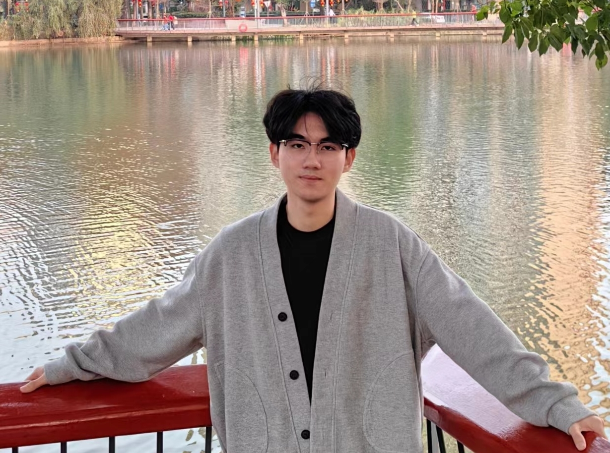 | 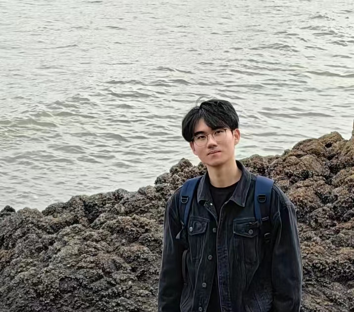 |
| 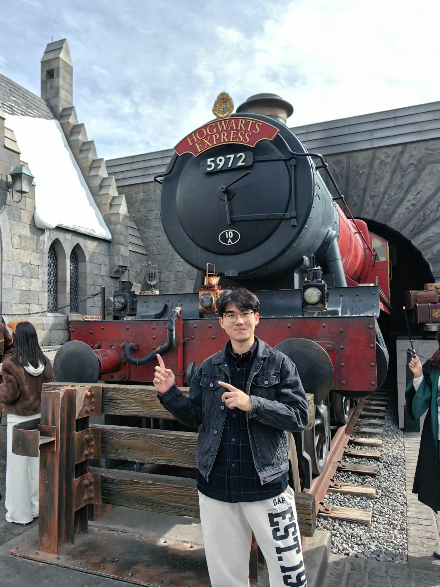 | 

--- 

## 2024.07.19
&nbsp; &nbsp; 从上一家公司离职到现在已经完完整整过了一周了，先后面试了8家公司也是顺利拿到了6家公司的offer，最终选择了一家上海的公司去当云原生开发实习生。  
&nbsp; &nbsp; 先来说说我都面试了哪些公司和哪些实习岗位吧，我想这个应该是你最想了解的。我先后面试了1家国企、 1家汽车公司、1家IT行业的公司、1个互联网大厂、1家外企和最后的做云原生开发的公司。
其中互联网大厂和一家IT行业的公司面试没有通过。我面试的岗位包括1个鸿蒙开发、6个后端开发（Golang和Java）和1个前端开发（前端是互联网大厂，鸿蒙开发是汽车公司）。
其中前端是刚好有个机会想去尝试一下，属于是体验一下大厂的面试流程和难度，在面试还没有开始我就猜到我应该是没有办法通过的。  
&nbsp; &nbsp; 讲完这个再来说说为什么我最后选择了上海的做云原生开发的公司，而不是鸿蒙开发的汽车公司或者外企。  
&nbsp; &nbsp; 先来说说鸿蒙开发岗位的这家公司吧，起初投递简历是因为看上了公司规模。这是一家大型的汽车公司，给我开到的工资是300RMB/天。
说实话，当我知道我面试通过了，并且有如此之高的实习工资的时候，我的内心开始动摇了，我开始纠结要不要去北京的这家公司工作（原本的打算只是想尝试一下）。
如果去了这家公司，我将在公司内从事基于鸿蒙的应用开发。
需要知道的是，我现在做的所有准备和过往实习经历都是为了找一份Java的实习工作（之前已经有两段Java的实习经历了），但是如果去了这家公司的话，我的实习方向就改变了。  
&nbsp; &nbsp; 鸿蒙开发是近一年新起的开发方向，其是基于华为自己开发的语言（ArkTS）和OpenHarmony SDK完成的。整个开发的模式和流程类似于安卓开发。而让我犹豫的地方也正是在此。
在我的认知里，这类似于做前端开发。组件的调用，页面显示，这些工作内容让我提不起兴趣，而且鸿蒙目前还是在起步的阶段，对于大学还没有毕业的我来说，未知性还是太大了。
“兴趣是学习的老师”，所以我决定放弃高昂的实习工资，放弃这一次实习机会。   
&nbsp; &nbsp; 接下来说说外企的这家公司吧。这家外企的公司名叫塔塔（TCS），是亚洲最大的IT咨询公司。其给我开到实习公司是4700RMB一个月，同样丰厚的薪水让我萌生了想去这家公司的想法。
顺带一提，我之前的实习工资都是160一天😭😭😭😭😭😭😭😭。让我犹豫是否去这家公司的原因是7.12号的面试细节和工作项目的技术栈。  
&nbsp; &nbsp; 当天是周五下午的面试，同行一起面试的同学还有两个。我们三个人一起在塔塔的杭州分公司面试，面试官有3个人，两位年纪稍大的经理和一位较年轻的技术官。
起初在做自我介绍的时候，我就觉得怪怪的。因为这是我第一次遇到多人技术面试的情况。带着这个困惑，我们三位同学完成了自我介绍。接下来就到了面试环节。
在面试中，我疑惑的地方加深了。一方面是面试问题的技术问题没有问太多，反而问的是我们的其他经历。当然这一方面的困惑不是很多，毕竟谁想被手撕算法或者刨根技术细节呢？
我疑惑的地方在于第二点，三位面试官的面试状态让我质疑起了他们的专业性。其中坐在中间的面试官一直在侃侃而谈，但同时带着耳机在开着线上会议。
最左边的面试官在抛出“斐波那契数列是如何实现的”这个问题之后就开始发呆玩手机。这两位看上去资历较深的面试官让我对整个公司的专业性产生了疑问（当热这个疑问轮不到我来评头论足）。
但最让我遗憾的在于工作内容。这个实习岗位是全栈开发（我对全栈没有那么抵触，但是也依然不喜欢全栈开发），然后后端项目是单体项目架构（这个是最让我遗憾的）。
由于项目的技术深度不大，而且工作内容大多是成熟系统的维护工作，所以让我对这家外企的工作提不起兴趣。所以最后拒掉了offer（4700一个月的工资没有了😭😭😭😭😭😭😭😭）。  
&nbsp; &nbsp; 最后来说说我为什么选择云原生开发这个实习岗位吧。  
&nbsp; &nbsp; 首先什么是云原生：容器化封装+自动化管理+面向微服务+服务网络+声明式API   
&nbsp; &nbsp; 云原生架构的应用程序: 采用开源堆栈（K8S+Docker）进行容器化，基于微服务架构提高灵活性和可维护性，借助敏捷方法、DevOps支持持续迭代和运维自动化，利用云平台设施实现弹性伸缩、动态调度、优化资源利用率。  
&nbsp; &nbsp; 其实我理解的云原生开发意味着：go语言+微服务架构+自定义容器化封装+承受更高的高并发+持续部署。
所以不管是技术难度还是技术的创新性，这两个方面都对我有极大学习动力。所以当我知道自己面试过了之后，我真的很开心，哪怕要去上海上班、在上海租房、工资150RMB 一天。   
&nbsp; &nbsp; 当然还有另外一方面的考量，就是Java太卷了。今年有大于1000万的大学生毕业，Java开发市场呈现严重饱和，Java开发工程师的供给远大于求。
作为一所普通高校即将毕业的学生来说，想要和985、211学校的学生竞争难度真的很大（学历不足，开发能力再优秀也没用，而且还要跟研究生竞争），更何况我不是计算机专业的学生。
&nbsp; &nbsp; 所以结合当下的真实情况和我未来的发展路线（成为架构师），以及我截至目前积累的Java开发经验，我决定尝试一次基于Go语言的云原生开发。
但同时我也不会拉下基础计算机知识的学习，因为目标还是秋招。   
&nbsp; &nbsp; 但是前路漫漫，我并不清楚自己当下这几天做出的选择是否是对的，毕竟要学习一门新的语言，会面临更多的挑战和困难。但我选择相信自己，
我相信自己所做的判断是最符合我的实际情况的，哪怕未知的困难再大，我也决定去闯一闯。今年6月份，我刚满21岁，我还有勇气，有决心。
我决定挑战自己，尝试一次云原生开发实习工作。  
&nbsp; &nbsp; 等10年之后，或许我能来跟你讲讲我来时的路。最后引用我喜欢的偶像们的两句话来结束7.19号的日记，一句是来自Jared McCain（an NBA player）的“Patience is key in life”，
另外一句是来自Sam Altman （CEO of OpenAI）的“What should we learn these day? Resilience ,adaptability,high rate of learning.”。

--- 

## 2024.07.26
Hello guys. Today I finally got the T-shirt from Neo4j.
This morning, I got a phone call from a courier .I was told there was an international package and have to 
receive express delivery before 11:00 am. I was too excited to do my job this morning because I knew
that is my T-shirt from Neo4j of completing the Neo4j graph database operation exam.  
And here is my T-shirt and certificate.  😊😆😆😆😆😆😆😆
* [It is my certificate you can click](https://graphacademy.neo4j.com/c/89e7e05d-96fd-4ca5-9b48-4ffed21ac6f0/)
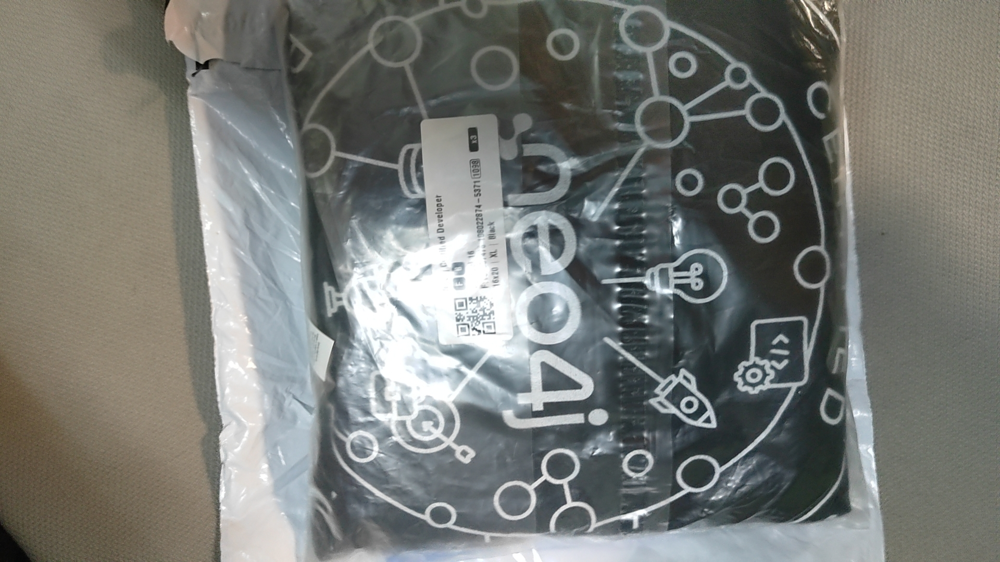
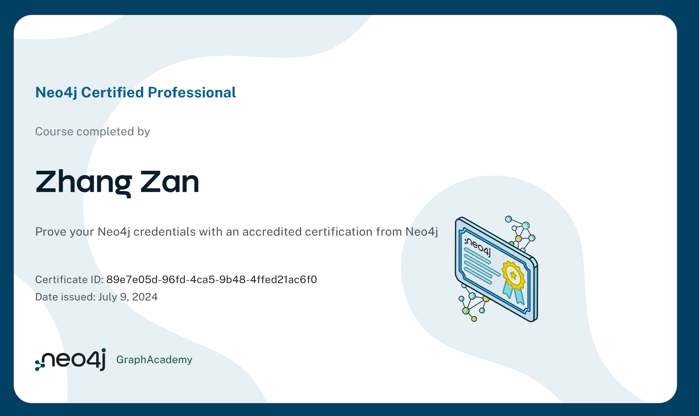

--- 

## 2024.08.25
&nbsp; &nbsp;  hello guys，好久不见，现在是2024.08.25号啦，距离上次分享已经过去一个月了，现在我又想来和你们聊聊最近发生的事情。
或许可能接下来我要讲的东西有点震惊但是确实如此，我现在去“好未来”公司了。或许你不知道好未来，但我想你一定知道学而思。没错学而思就是好未来。   
&nbsp; &nbsp;  人总是要不断地向上攀升的，当又更好的机会摆在我的面前，我一定要全力获取，而不是眼看着机会从我眼皮底下偷偷溜走。  
&nbsp; &nbsp;  现在我从事的岗位是初级php/Golang开发工程师，从事基于Go的web开发工作。从工作性质来看，web开发可能和云原生开发有一定的区别，
但我确实是成功进入Go的圈子了。我入职时间是8.7号，到现在为止已经过去两周多了，已经完成了一个小的基于Gin框架的web应用。
不得不说，go的语言特性和channel + routine的使用深得我心。更加灵活的开发、更加简洁的语言，更加灵活易用的第三方中间件sdk
都让我的开发效率有的极大的提升。不像臃肿的java + spring，go真的让我大开眼界。现在看下来，google人员基于go完成
kubernetes的开发非常有道理。
&nbsp; &nbsp;  此外好未来公司和项目团队也真的非常好😄，大家每天都笑嘻嘻的，同时也在很努力的完成工作。然后公司这边新大楼也建好了，
公司很漂亮，还有健身房!!!💪💪💪💪而且健身房又大又新又好看。真的这就是我的梦中公司。  
&nbsp; &nbsp;  但是呢，即使现在这么好，我觉得我也要头脑清醒。当更好的机会出现在我面前的时候，我像我也应该做出恰当的抉择。
但也正是如此，我也应该珍惜这来之不易的机会。  
&nbsp; &nbsp;  讲了这么多，我想来和你说说我之后的打算。现在的我呢应该是铁了心从事go的开发了，当然根据现在的项目可能会写一点php
但是这都无伤大雅。后面将会使用go来完成的诸多个人项目，这个强大的语言我还在好好学习，我相信go的潜能一定能不断释放，为我打开云原生的
大门。同时我也将基于go完成一个AI项目，现在的想法大致有两个，一个是手表端的AI智能检测（主要是分析人体各项数值），
另一个基于AI完成ES的分词功能，同时在Go的基础上完成搜索+推荐系统框架的搭建。按照我的直观想法的话，我可能会选择后者。
然后我的目标应该就是求一个转正保底，然后通过这个AI项目全力冲刺明年春招！！！🚀🚀🚀🚀🚀🚀   
&nbsp; &nbsp;  我最近的想法大概就是这样子啦，😄😄😄😄😄。下一次分享应该就是一个月以后啦，那我们下次再见
* [这是我做的第一个Go项目](https://github.com/ZZGADA/Upload-File-Project)

--- 

## 2024.09.09
&nbsp; &nbsp;  hello guys,我真是太开心了，刚刚看到了一个令人激动的图片！！！我的软著批下来了😭😭😭😭，
等了我好久啊，我心心念念的软件著作🥹🥹🥹🥹。虽然技术很重要，但是总是需要一些东西来为自己的经历证明，这个软著就是
最好的证明。  
&nbsp; &nbsp;  很开心，很开心！🚀🚀🚀🚀最近都是事事顺利[img.png](ZZGEDA/property/software-property.png)

--- 

## 2024.10.4
&nbsp; &nbsp; hello guys, such a long time no see.时间过的好快啊，转眼就到金秋10月了，不知道你们过的好吗。我呢🤔，
怎么说呢，过的好也不好。过的好是因为遇到了很多很好很好很好的人，他/她们都非常的优秀和努力，而且对我也很好，真的非常的感动。
每天和他/她们一起努力奋斗的感觉真的非常好，学习的动力满满，感觉可以学一天。我想如果我最后离开北京了见不到他/她们了那我一定会非常非常的难过。
再来说说过的不好的地方吧。过的不好是因为没有很好的就业成绩，马上要转正答辩了，虽然转正答辩大概率是过的，但是还是想去更大的公司，
去更大的平台。我现在21岁，不能就此停滞不前啊，而且大厂的工资是真的很高啊😭😭😭😭。但是去大厂也是真的难，要算法，要八股。
对我来说要看的东西有点太多了，而且还要跟其他研究生一起竞争，这对我来说真的有一种深深的无力感。人那么多，offer真的会给到我吗。
就是因为眼下的这种情况，让我有点想呆在好未来这里。就算我能进大厂，但是我能保证在3个月的试用期内表现好然后成功转正吗。
所以挑战真的很大，我要在最短的时间做出最大的绩效成绩。  
&nbsp; &nbsp; 长路漫漫，无限进步♾️。  
&nbsp; &nbsp; 确实我会沮丧，但是我绝对不放弃。我要成为那个最牛的本科生。身边的一切都值得我好好学习，不断的探索和深挖技术，
向身边优秀的人学习。什么微服务、分布式、高可用、集群、高并发、设计模式、操作系统、算法，数据库，计算机网络，我全部都要拿下。  
&nbsp; &nbsp; 最后，祝你也祝我天天开心，永远永远要最真诚的对待他/她人，遇见的每一个人都是生命中不可多的的美好回忆。
如果身边的人不开心了，就尽可能的帮助对方，这也是你（张赞）一直都在做的事情，请继续保持。 
&nbsp; &nbsp;  那么今天就这样，今天肝完了Kubernetes弹性伸缩的项目，感觉还不错。如果你阅读到这里的话可以点进去看看哦。
[Kubernetes弹性伸缩项目](https://github.com/ZZGADA/Multiplexing)。  
&nbsp; &nbsp;  无限进步，forward infinity

---

## 2024.10.05
这个视频冲击力真的太强了，无地自容
[极海哥频道刷到的面试视频](https://www.bilibili.com/video/BV1R6xQeoEt6/?buvid=XU8AD778F6B8E93B1A9CA4797A1D3177A135C&from_spmid=main.my-history.0.0&is_story_h5=false&mid=tyPCIvy2TjbqtcmLfOhYFg%3D%3D&p=1&plat_id=116&share_from=ugc&share_medium=android&share_plat=android&share_session_id=50bbba71-ef07-4cab-bff0-21468fb4cd64&share_source=WEIXIN&share_tag=s_i&spmid=united.player-video-detail.0.0&timestamp=1728123109&unique_k=XHAZt2S&up_id=1525355)

--- 

## 2024.10.17
&nbsp; &nbsp;  很开心,很开心.就在刚刚同组的实习生姐姐进虾皮的hr面试了,然后另外一个认识的实现生也通过了华为的三轮面试,都在等结果了,这真是太棒了👏👏👏😋😋😋🌆   
&nbsp; &nbsp;  看到大家最近都有好消息真的很开心,相信她/他们一定可以顺利的拿下,然后顺顺利利的入职成为后端开发工程师.美滋了~.  
&nbsp; &nbsp;  虽然他/她们可能看不到我在这里写的碎碎念,但是真的很为她/他们感到开心和喜悦😀.相信她/他们可以走的很远很远,然后梦想成真.😼😆😁😄  
&nbsp; &nbsp;  今天很开心,所以来更新一下.最近总结完了三种设计模式类别中的两个了(**结构型模式**和**行为型模式**),各位如果感兴趣的话可以来看看哦.    
    [设计模式-go&java](https://github.com/ZZGADA/design-pattern)

--- 

## 2024.10.18
&nbsp; &nbsp;  不要丢失了你对技术的热情

--- 

## 2024.10.20
&nbsp; &nbsp;   要遭不动了，真的很难想象，那些大佬在那么大的压力下是如何做的头脑清醒的，然后按部就班完成高并发多线程的开发的。   
&nbsp; &nbsp;   真的太夸张了，果然说是说，做是做。自己写了并发场景下的代码才知道有多难。

--- 

## 2024.10.21 
&nbsp; &nbsp; 本周主要是学习了设计模式，把结构模式和行为模式梳理完了，然后依据其中的设计模式思路做了一个实操。
&nbsp; &nbsp; 让我看看时间，现在是晚上9:54，刚刚锻炼完，洗完澡，坐在床上开始码字。今天是为期三天的开发总结和最近的一点点🤏小小的感悟。   
&nbsp; &nbsp;   实操内容是如何在多实例多线程情况下实现redis缓存和数据库数据的一致性。这个周末实现的是单例模式+分布式锁的解决饥方案。
主要内容是使用分布式锁保证写操作和读操作只有一方可以持有锁进行缓存key的删除或者更新。当时这只是一个周末做的一个部分🤔，还有很大一部分是如何将设计模式引入到自己搭建框架当中。
其中最最核心🎯🎯🎯🎯的单例模式。怎么样没想到吧。此次单例模式的主要实现其实是在依赖注入中。通过单例锁实现结构体内成员变量的依赖注入。从而无需显示的线性对所有结构体进行初始化，
或者是使用全局变量维护这些实例。这个部分花了很大的功夫和思考🤔。可以点开我的文档看看哦[redis缓存和DB数据一致性使用场景](https://github.com/ZZGADA/design-pattern/tree/main/go/syncache)。
通过这个实操让我充分的学习到了原来Java的Spring是这样运作的，我的核心思路也是有点借鉴Spring的依赖注入模式，从而让我的代码变得相当优雅（有点自吹自擂了，哈哈哈哈哈哈🤣🤣🤣🤣，但是我自己觉得真的写的不错，如果有任何问题欢迎来指正，我需要你们的建议和意见）。   
&nbsp; &nbsp;  除此之外这周还完成了导师分发下来的三个需求，其中一个已经正式上线，还有一个已经上到测试等前端连调，还有一个由于是纯前端的需求，我只用加一曾过滤就好了，所以这个需求约等于已经实现了。
后续的中心应该还是在完成需求✅，导师跟我说会上一点难得模块，为此我感到非常的兴奋。今天下午就开始做慢sql的优化了（发现其实sql没啥问题，要到实际的场景中看代码才能解决了）。

&nbsp; &nbsp;   说了这么技术上的，也该聊聊我最近咋样了，我知道你很好奇，所以让我慢慢记录📝一下。好像从国庆开始，自己的神经就一直处于一个紧绷的状态，每天无时无刻都在告诉自己要持续进步，
不要松懈。起初最开始让我有一点点疲惫，因为忙绿了很长一段时间了，但是后面也直到现在我也慢慢又习惯了这种感觉。这种感觉非常的熟悉，像是我大二的状态，有点像是回到子良212了。   
&nbsp; &nbsp;   子良212是陪伴我两年的一件教室，它在我们的老校区。我们老校区一进门就是这个大楼，历史悠久，底蕴深厚。起初是在不经意间发现了这个教室，这个教室很小，坐满人的话，也只能坐下20个人。
可能就是这个教室很小的原因，所以这是一间没有排课的教室。没有排课的教室很舒服，一个人的话，空间很大。没有其他人的窸窸窣窣，也没有低语的焦虑和不安在隐隐作响。只有一个好奇的少年，每天探索着新的知识。   
&nbsp; &nbsp;   这是一间承载着我两年快乐时光的教室。我们大️一、大二的课不多，我就时常来这里自习。打开电脑，喝杯速溶咖啡，我可以熬到晚上10:00了。当时的我很快乐，每天都在被新学知识震撼到：
原来放缩是这样的，原来这就是梯度下降、原来神经网络是这样做反向传导的，原来Java的spring是如此的抽象和强大。当时的我学到了很多东西，开始试着完成java的web项目，给C++的桌面客户端程序做一个收尾（后面拿着这个比赛了，结果也还不错👏），
然后也第一次感受到了算法，准确来说是概率论与梳理统计带来的强大震撼。有点记不清了，当时手搓了好多模型（dp神经网络、线性回归、随机森林、XGBoost这些吧）。   
&nbsp; &nbsp;   但是，就是这样的时光也会有被扭曲和冷眼的时刻。可能是因为在管理学院的原因，当我与周围的人聊起这些东西的时候，总是会显得格格不入。大家会认为我是一个很牛的人，但是给予的不是平等的交流和探讨而是认为我“高高在上”。
这种感觉很不好受，我最讨厌的就是被人扣上一个大大的帽子或者标签🏷️。起初我没太在意，直到被身边的人背刺。说来也奇怪，因为我从来不会这样对人，以至于到现在回忆起来，我完全不明白这些事情的前因后果。
但是过去的也终究会过去，对于所有我遇见的人我还是想说一声“谢谢”，无论好与坏，这些都是漫漫长路的一部分。  
&nbsp; &nbsp;   现在回忆起来那段时间，可能真的是我最无忧无虑学习的时间了，同时也是最让我独立的一段时间，自己学习计算机，自己做项目，承担团队的开发任务，处理好人际关系。很快，过了那个大二，我也顺利的在去年2023年的暑假跟着我的导师进了组，做起了项目。
当时跟着中国烟草做了数据分析📊的项目，让我对预测模型、时序问题有了更深的理解。当时承担起了我团队内卷烟新品的市场容量预测任务，好不容易才将预测误差MAPE降到35%，总共350个样本的小数据，你是要搞shi我。
再然后就是国家电网的开发项目，又回到了我最喜欢的开发环节，嘻嘻。然后的然后就是三段实习，直到现在。真的很难想象，去年的这个时候我还在紧锣密鼓地用flask框架开发国家电网的知识图谱项目，现在我在北京好未来的一个团队里逐渐开始承担一系列开发任务（当然现在的任务量还没有很多）。
所以这段时间的我，有时候很恍惚，感觉时间还是过的太快了。   
&nbsp; &nbsp;   然后就是最近的这个周末，我在好未来大楼的9楼的一个小房间了。这个教室很空，之前有两张桌子，现在只有椅子。然后我坐在地上，左手边是一杯速溶咖啡，面前是一个电脑，屏幕闪烁的是我周末写的代码，
然后窗外是灰蒙蒙的，很安静。我带着耳机看着代码一行行的写完，想着如何写的更加规范和优雅。有那么一瞬间我真的仿佛回到了2022年～2023年的那个大二。也是独自一人，一杯咖啡，一个电脑，一坐就是一天。然后下午打个球，洗个澡，继续学习。
不知道你有没有见过乔布斯席地而坐的一张照片。乔布斯在他的家中，家里空荡荡的，只有一个床垫，一盏灯，和为数不多的家具。当时有一位造访者来到了乔布斯的家中，记录下来了这张照片（很不好意思，我忘记了造访者是谁）。我当时的样子和这个很像。
或许是下意识的模仿，因为乔布斯是我的偶像。我在大一的寒假读完了《乔布斯传》，当时是疫情期间，我在隔离房内，没错我被学校隔离，然后我就很幸运的一个人坐拥一整个楼，享受着免费一日三餐，读完了这本书。
要不是最后运行报错了，我可能还沉浸在这个氛围里面。   
&nbsp; &nbsp;   该怎么说呢，最近这段时间。虽然焦虑，但是也很满意现在自己的状态。每天能学12个小时以上，不会的知识也在不断的补足，然后健身计划也在稳步进行（今晚深蹲破100kg了，可喜可贺🎉，上次硬拉也已经90kg了✌️）。
我还是挺满意我现在的自己的。可能为数不多觉得可惜的就是是同组实习的姐姐也要走了。姐姐要好好准备秋招了，姐姐很厉害，相信姐姐一定100%将大厂offer斩于马下。
还有一位我之前提到的实习生，他现在也是稳稳的，一定也可以拿到满意的offer，小小华子必定是他的啊。    
&nbsp; &nbsp;   看着新认识的人又不断的说拜拜，这种感觉是不舒服的，但是也无可奈何。   
&nbsp; &nbsp;     在时间的长河里，我们总是会遇到那些一下子惊艳到你的人，他们就像是流星，在天空中划出一道明亮的弧线后又让夜晚回到静穆当中。所以我总是感激与人的相遇，一次次的相遇都是天赐的礼物。
或许离别是伤感的，但是也要祝愿所有人前程似锦，以梦为马，自信且坚定。    
&nbsp; &nbsp;   如果你看到这里了，希望你天天开心（这是我最爱的一句话），长夜漫漫，星光璀璨，forward infinity～     
&nbsp; &nbsp;  “放弃”永远都不在我的字典里。已经11；30了，晚安，祝你好梦

--- 

## 2024.11.07
&nbsp; &nbsp; hello guys such a long time no see. 时间很快啊，转眼见我已经来好未来3个月了（我是8.7号入职的，现在满打满算就是3个月了）。先来告诉大家一个好消息，我成功转正了，已经拿到正式的offer了😁。
我是在昨天晚上6:00得到了hr的最终结果和确认消息，很开心，算是给3个月来的自己一个还算不错的结果。在这三个月时间内，做了三个项目，在机网、算法、OS、数据库、go都有了更加全面的了解、提升和感悟。
如果你对我这三个月做的事情感兴趣的话可以点击这里哦👉[设计模式go & java项目](https://github.com/ZZGADA/design-pattern) 和 [kubernetes组件 弹性伸缩项目](https://github.com/ZZGADA/Multiplexing) 🚀🚀   
&nbsp; &nbsp;  但或许会让你感到意外，现在我的情绪，并不是得到offer后的欣喜、激动、震惊，而是**迷茫**。   
&nbsp; &nbsp;  先来说说这个感觉像什么吧。这种感觉像大家考完高考后一个月的感觉。在高考最后一门考试过后，我们的肾上腺素达到峰值，随之而来的是持续性兴奋，有对未来的畅想，有对自己过去三年的感悟。
那个时候人人都很开心。但是一个月后，可能是在志愿填报的时候，也可能是知道自己高考失利之后，肾上腺素和多巴胺回到正常水平，我们开始变得冷静和沉默，我们会认真的思考我们的未来，我们会思考我们究竟喜欢什么，我们究竟想做什么，我们究竟想要达到什么样的高度。
诸如此类的问题和情感在那时会涌入我们的脑海占满我们的情绪，而我现在的状态和情绪就是如此。    
&nbsp; &nbsp;  迷茫是人生的必修课。三年前也就是2021年，在高考志愿填报上上第一次产生了 **迷茫** 的情绪。我开始思考我未来究竟想做什么，我想成为什么样的人。这个答案我至今还记忆犹新。
我不怕你们笑话我，当时我的想法是 **“我要成为计算机和管理学交叉方向上的人才”** 。所以我非常坚定的选择了浙江工业大学的管理科学专业。（当时我的核心院校有几个分别是华北电力、深圳大学、大连海事、浙江工业，但就是有了上面的这个思考之后，我毅然决然的将浙江工业放在了最前面，然后也是顺利录取了）   
&nbsp; &nbsp; 这是我第一次有了迷茫的情绪，所以我印象深刻。但好在迷茫的时间不长，我大概花了三天时间就想清楚了，然后就是正常的等待录取通知书了。顺带一提当时有想过复读，因为生物考的太烂了，拉了我的后腿。当时数学、语文我最担心和害怕的学科到达到了均分80%的标准，物理达到了90%的标准，我很满意，但就是一个生物，哎～。但是过去就过去了，有时候当成调侃自己的话题也是很有意思的，嘿嘿😁。    
&nbsp; &nbsp; 然后的经历大家在上面就已经看到了，我一直在计算机方向上持续努力，并有了一点点小小的成就。其中上一次**迷茫**就是我决定是否转go的时候了，这部分的思考可以看看我**2024.07.19**的记录哦。   
&nbsp; &nbsp; 再然后就是现在了，现在的我仿佛又处于一个十字路口上，看不清收到offer后我该走的路。     
&nbsp; &nbsp; 是继续实习？是继续钻研数据库、OS等一系列专业知识？是钻研go？是回学校享受校园生活？是准备2年后的出国？是继续冲刺大厂？是去旅游趁年轻多看看？是回家陪陪父母和妹妹？这一系列的问题像海啸一样从昨天晚上冲击着我的大脑，让我头重脚轻。   
&nbsp; &nbsp; 当然这一系列问题和迷茫都可以用**一句话**或者**一个标签**概括——“我是一个双非非计算机科班的本科生”。      
&nbsp; &nbsp; 因为我是本科生，所以我比研究生少了三年成长的时间，我要在4年本科时间内夯实基础，做出项目，有个人的特色并能解决计算机开发和业务上的问题，用我的个人经历证明我不比研究生差。   
&nbsp; &nbsp; 因为我是一个双非本科生，所以我在求职的路上注定要接受一些冷眼和瞧不起，那我就要通过我实际的产出证明我的专业性，证明`双非`这个最大的标签在我身上没有阻碍作用。   
&nbsp; &nbsp; 因为我的非科班生，我没有丰富的计算机学习氛围和资源，只能一步步摸索，依靠热情和勤恳不断学习，查漏补缺，一步步捡起拉下的知识和不熟悉的知识。   
&nbsp; &nbsp; 对于上面👆的问题，我没有办法在今天这个时间点给出一个我的答案，还需要时间想清楚自己欠缺什么，需要在什么地方继续努力，需要时间思考下一个要达到的高度是什么样子的。
但是我可以告诉大家，我现在对于自己的定位是——**“我要成为在计算机方向上有丰富成绩并能用计算机知识帮助他/她人的人”**。  
&nbsp; &nbsp;  接下来的3-4天就让我好好思考一下吧，刚好快到周末了，会见我的好兄弟。我想听听他的建议。

--- 

## 2024.11.9 

&nbsp; &nbsp; 嘿嘿，今天又来记录了，但是不是讨论和确定上面👆的问题，而是想来和你分享最近发上在我身上的趣事——那就是“北京环球影城！！！！！”
🤤🥳🤩🤪😆😁   
&nbsp; &nbsp; 真的环球是真的好玩啊，很新奇的体验，很好吃的鸡腿🍗，嘿嘿😁。话不多说，我们直接看照片，真的绝对美滋了，太香啦。

* 这是我和我的姐姐！！！😁，两个人为了吃玉米热狗绕了一圈，一直在问工作人员玉米热狗在哪里，笑死我了🤣🤣🤣🤣。🌽🌭“您好，您知道哪里有玉米热狗吗？”真的就这样问了一路，哈哈哈哈哈哈   
  然后我们一人吃了一个雪糕，我吃的是草莓芝士🧀，我姐吃的是小黄人。是真的好吃啊。谁说冬天不能吃雪糕🍦，好吃的我都吃😁

> | 我和我的姐姐                                     | 雪糕                                       |
> |--------------------------------------------|------------------------------------------|
> | 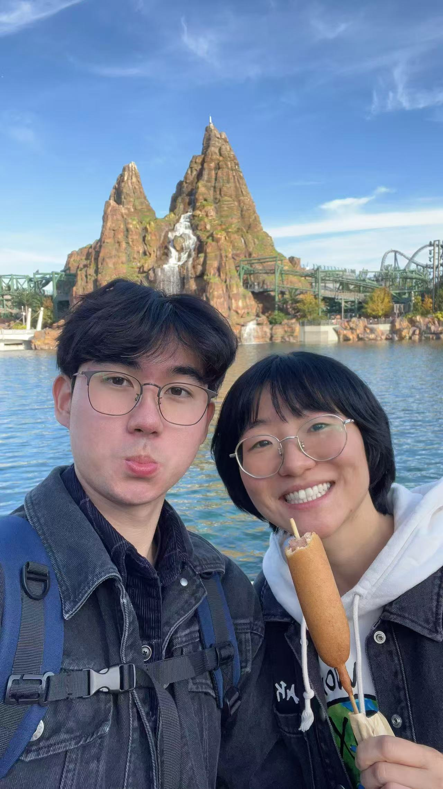| 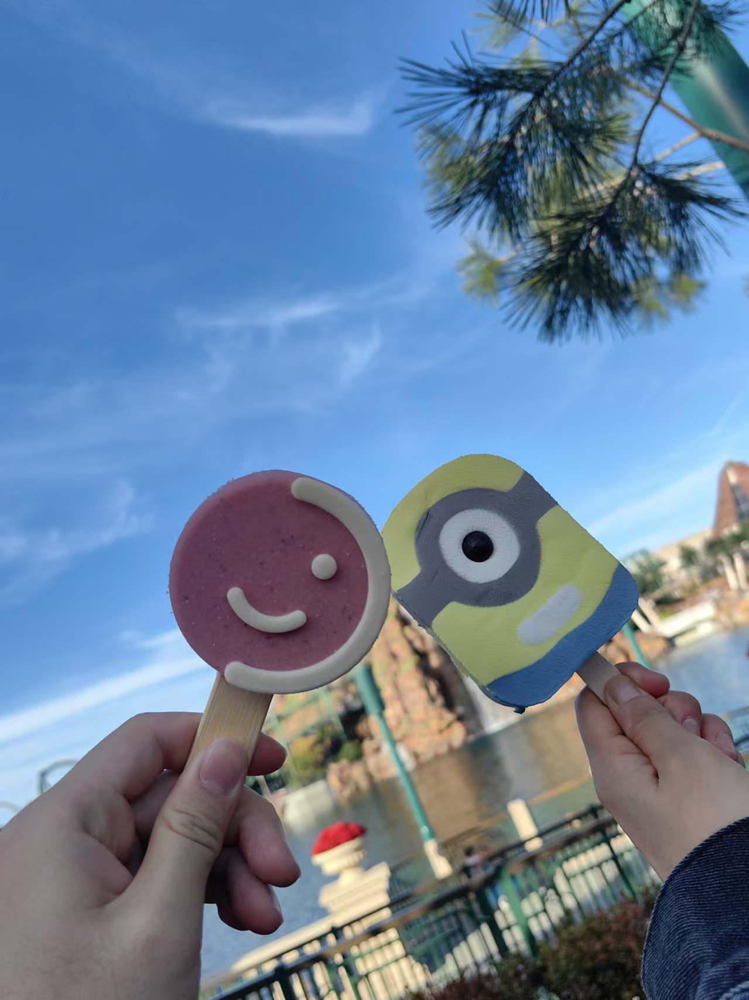 |

* 然后我们去玩了“侏罗纪世界”，很刺激，很真实。我是真的好奇，那个恐龙是怎么做到如此逼真的，我来给你们看照片。如果你去到侏罗纪主题园区，一定要去！！。强烈安利，good，good👍👍👍👍   
  裸眼恐龙🤤🤤

> | 恐龙🦕                                      | 恐龙🦕                                      |
> |-------------------------------------------|-------------------------------------------|
> | 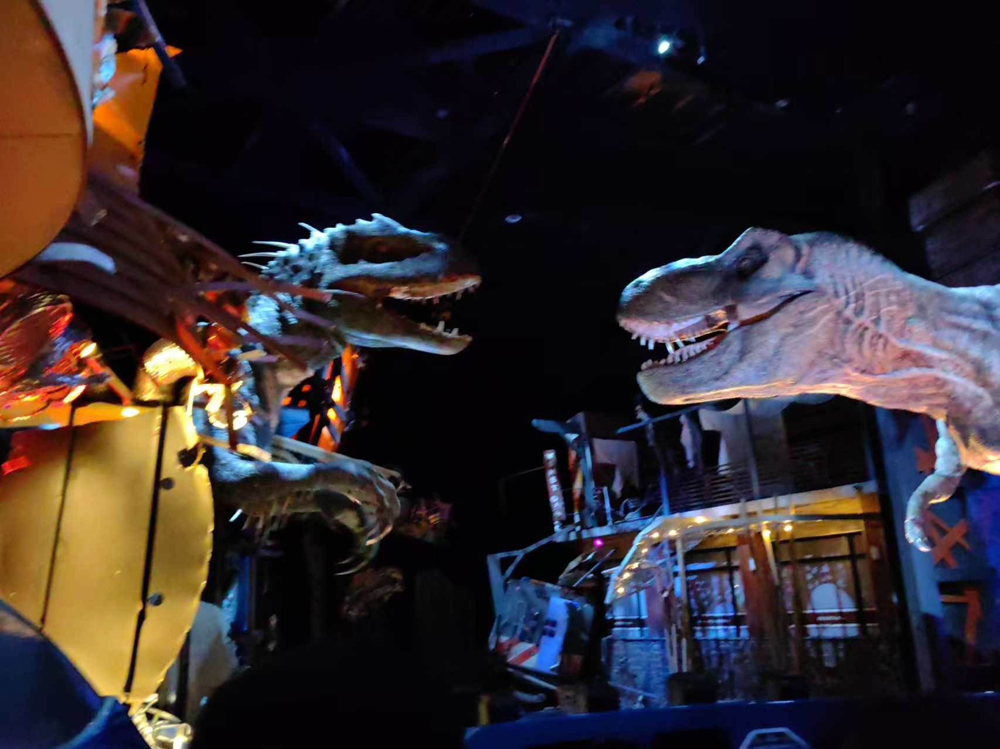 | 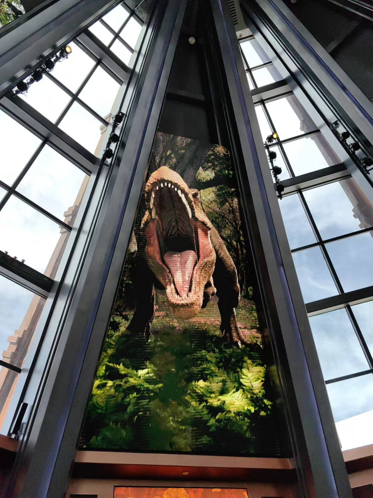 |

* 再然后呢，我就去了“禁忌之旅”！！！（其实是第一个去的，优先排队，但是速度很快，50分钟）。哈利波特，这个主题无敌了，好好体验了一下做扫帚🧹的感觉。有点晃晃悠悠的，但是感觉很nice。    
  如果你是哈利波特的狂热粉丝的话，我想你一定会非常喜欢的。但我只是想去玩项目，我看到好多人穿着哈利波特的袍子，非常有代入感。

> | Harry Potter                           | Harry Potter                           |
> |----------------------------------------|----------------------------------------|
> | 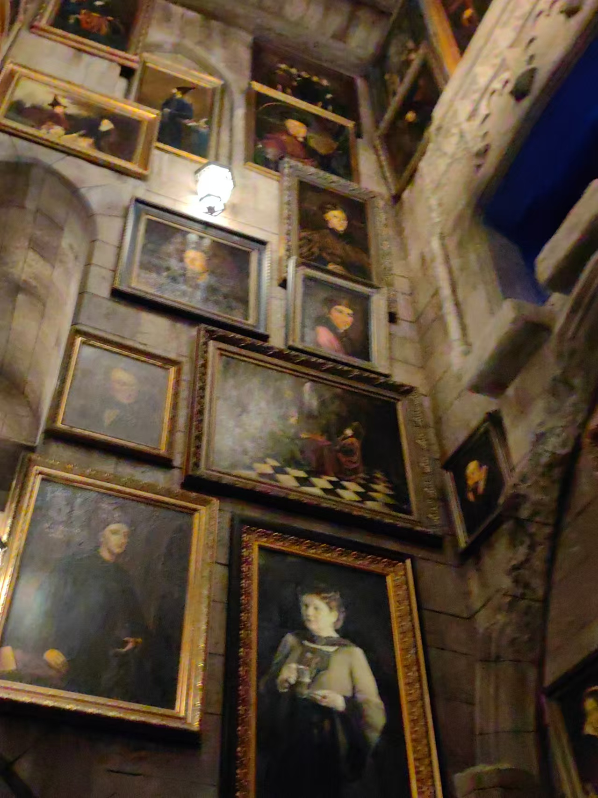 | 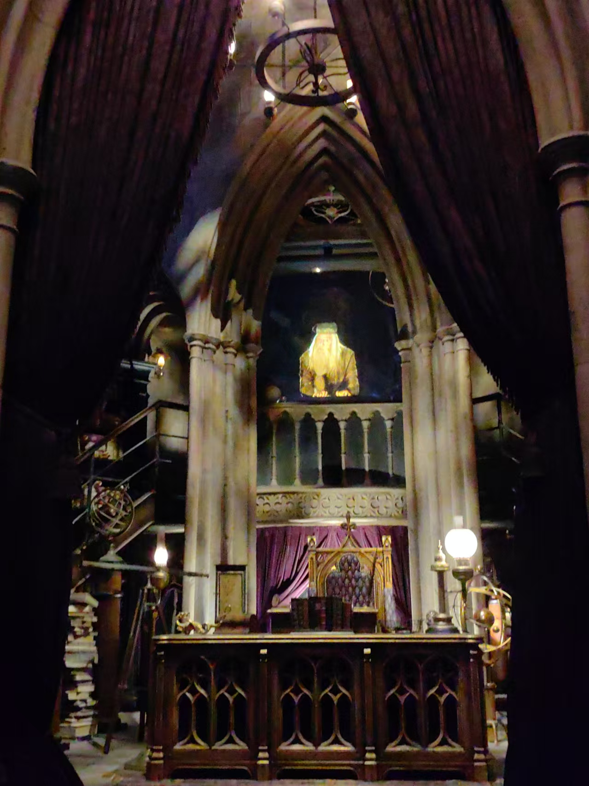 |

* 然后就在我们找玉米热狗的路上，我无意间找到了《不可驯服》的演出场地，然后刚好是当场表演的最后入馆时间（不用排队！！！）。一听到工作人员说“马上开始”，我跟我姐直接开始狂奔，我把我姐甩在了后面，哈哈哈哈哈哈（sorry 姐姐）。   
  然后就顺利落座开始看《不可驯服》。真的相当精彩，我很喜欢，尤其是看到Toothless没牙仔从空中出现，真的惊艳。来来来，给你看照片。   
  没牙仔，作为我最喜欢的动漫IP角色之一，真喜欢。😋😊

> | Toothless                                  | Toothless                                  |
> |--------------------------------------------|--------------------------------------------|
> | 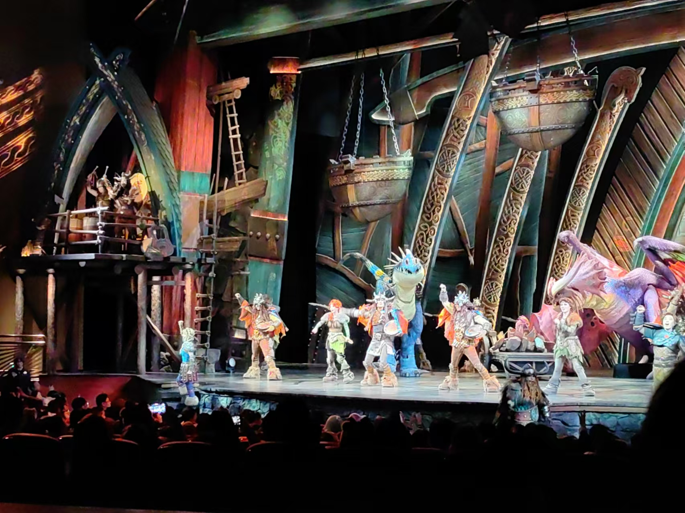 | 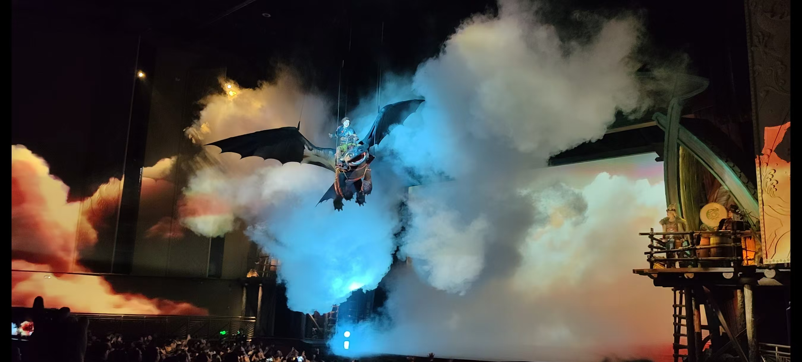 |

* 然后让我想想，还有啥啊🤔。oh对，还去了小黄人。小黄人很nice的，也是裸眼4D的项目。谢天谢地没有真的放臭屁炮。很喜欢格鲁，坏坏的想法，但是有很善良的心。    
  小黄人，我妹最喜欢的IP角色。之前去日本环球还给她买了一个小黄人的眼镜，哈哈哈哈哈，好想找出那张照片。那个时候我妹刚刚换牙，缺牙齿的样子非常可爱。这个照片在云上面，我要找找。   
  然后玩完后，我在小黄人的礼品店买了很多礼物送给别人。然后，哈哈哈哈哈哈哈，看到了一个巨有意思的东西，真心动了。哈哈哈哈哈哈，🤣🤣🤣🤣🤣。

> | 哈哈哈哈哈 就是这个 真喜欢                           | 小黄人                                        |
> |------------------------------------------|--------------------------------------------|
> | 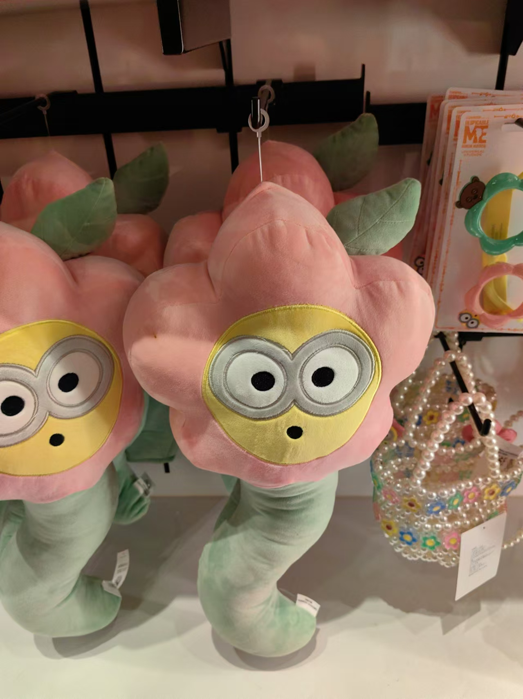 | 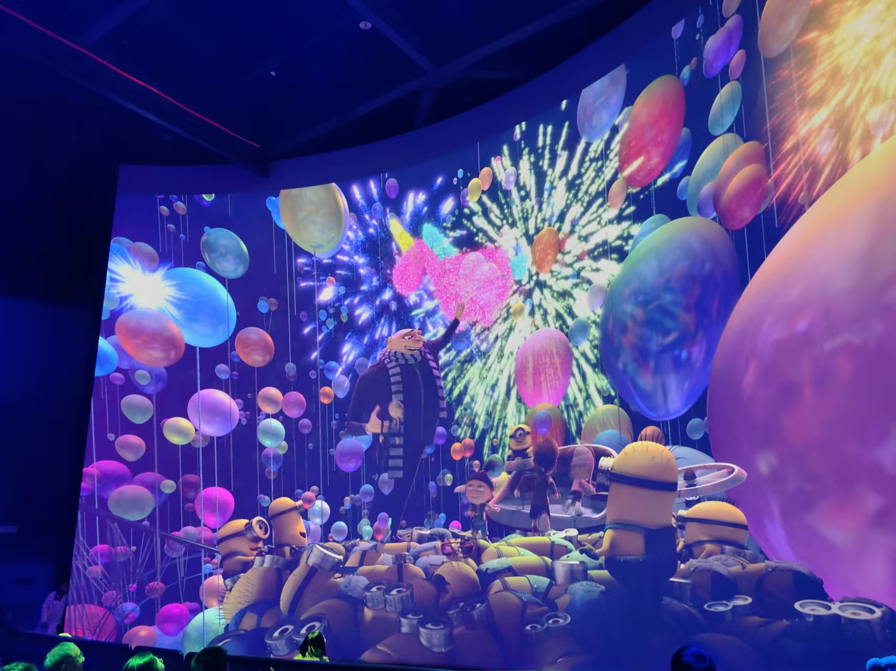 |

* 我们还去了“变形金刚”主题，小男生的梦大概就在这里，可惜我已经21了😎🤓，我一个小老头。那个4D项目，超级帅，是真的帅。作为《变形金刚》系列的忠实粉丝，看到那个画面是真的帅。   
  当霸天虎发射火箭炮的时候，是真的有热气，沉浸感拉满了。综合好几个4D项目，我最喜欢这个。一个字，帅。(可惜没拍照片，光看了，因为太帅了)

> | 变形金刚 transformer                             |
> |----------------------------------------------|
> | 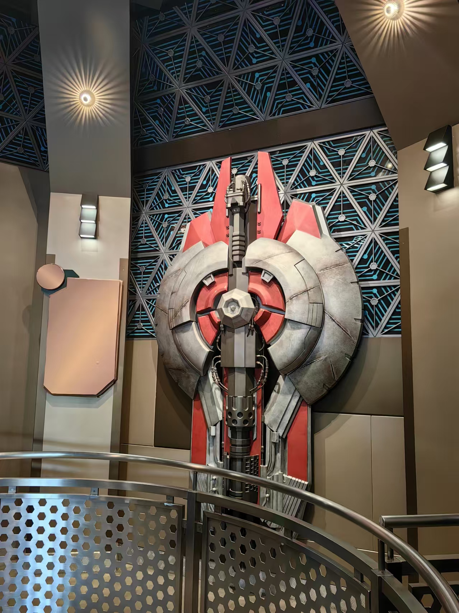 |

* 最后我去了“功夫熊猫”主题，作为环球影城-北京的特色主题公园，怎么能不去呢？但确实是针对小朋友的游乐场，有个“旋转盖世5侠”，哈哈哈哈哈哈，很有特色。其他都是旋转木马，这里是旋转“旋转盖世5侠”，哈哈哈哈哈，很有特色。   
  我要带我妹来玩。 但是诶～，没拍照片，有个在那里掉单杠的照片，但是在我姐手机里。哈哈哈哈哈，好希望可以撑到1m 30s，但是那个单杠是可以旋转的，导致我一直在往下掉，不然我绝对不止撑到60s，难休。  

* 这次真的就是最后了，给你看没牙仔玩偶在我姐包上的装饰效果。😎🥳，好看🤩。

> | ending                                     |
> |--------------------------------------------|
> | 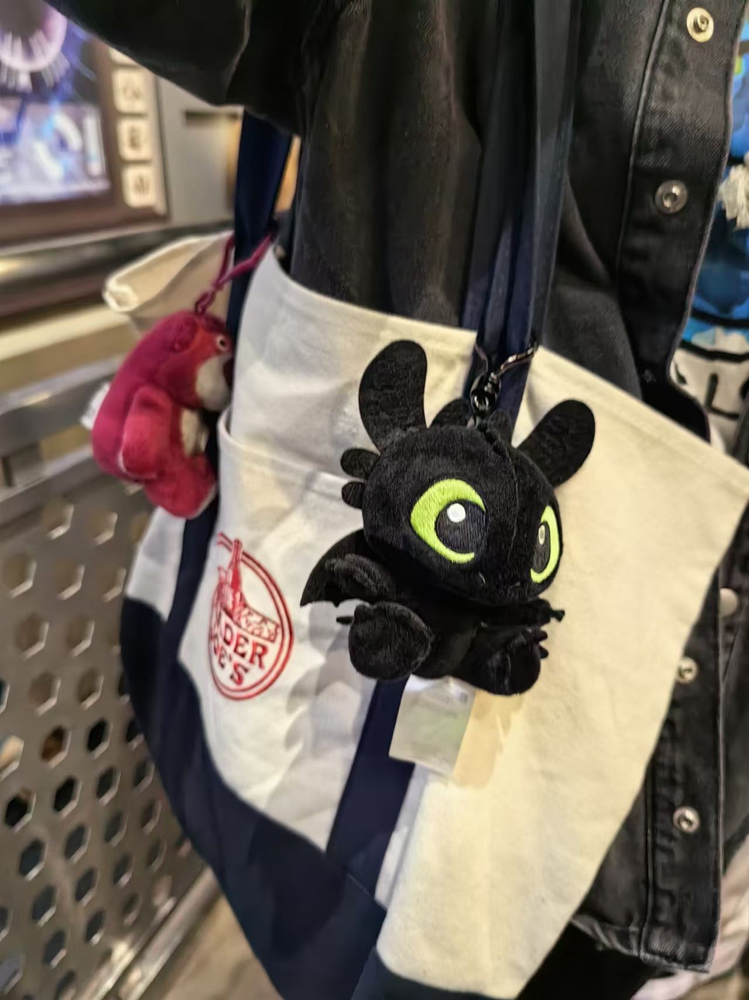 |

* 总结一下：这趟环球旅程是真的有意思。环球还是那个样子，依然是我心里游乐场的top1，上次在日本玩的印象就很好。但最最关键是和我姐一起，好久不见，甚是想念。   
  对我来说，出去玩做什么都不是重要的事情，重要的是和谁一起，毕竟这是属于和我一起出去玩的人记忆。   
  好了，这就是我的近况了，嘿嘿～，其实心情很好（其实一直都很好），大家不要被我上面的状态和情绪吓到了，上面只是有些思考罢了。

--- 

## 2024.11.10
&nbsp; &nbsp; 该如何描述呢？让我慢慢给你说。   
&nbsp; &nbsp; 昨天见了我的好兄弟，互相分享了最近的近况。发生在我身上的事，你已经都知道了，我就不再娓娓道来了，关键是我的好兄弟，他的故事好像有点不太一样。  
&nbsp; &nbsp; 我的好兄弟现在一个大厂实习，岗位是算法岗。当`大厂`+`算法`，两个互联网最顶级的名次出现在了我的好兄弟的身上时，我真的非常高兴。看到他一步一步走来，我真的为他喝彩和骄傲🎊。
所以当他去实习的时候，我为他感到开心。但是当我昨天询问起他的近况的时候，好像事情并不是这样的。（我只简单带过，不想多做展开，毕竟这是我好兄弟的隐私，所以我只说公司层面的事情）  
&nbsp; &nbsp; 他们组的实习生很多，工作量很多而且很杂。作为算法岗，他的工作清单中有“标注”的任务，这让我感到十分诧异。其次是一层又一层的标准化流程：日会、周会、PPT演讲，8:00后的餐补，每一天的时间线都卡的严丝合缝，这让感到奇怪——“满血互联网企业为什么会有如此之多条条框框的约束”。
再然后就是耳熟能详的工作压力。真的，作为一个实习生，不知道为什么要安排这么满的工作量（是剥削？是压榨？）所以跟他聊完，我觉得他很辛苦，希望他多多休息。   
&nbsp; &nbsp; 当然最关键并不是这个，让我震惊的是`“商业模式”`  。个人信息成为了资本谈姿，羊毛出在羊身上羊来买单。对于这种事情，我感到反胃、恶心，并痛斥这种不正义、不人道的盈利模式。   
&nbsp; &nbsp; 可能为数不多的宽慰是他可以拥有6张A100做模型的训练，真是苦了我的好兄弟了。

